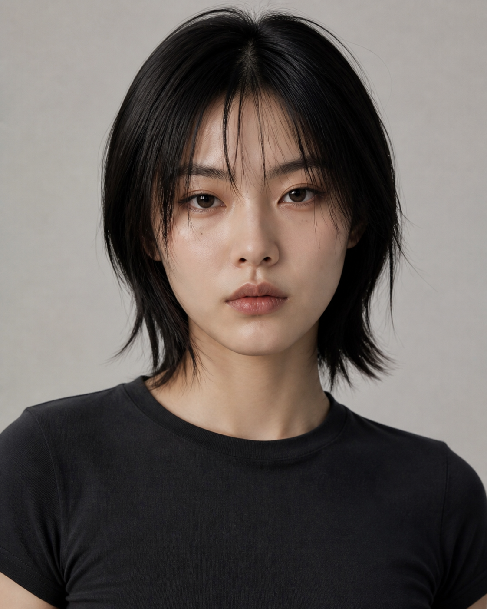
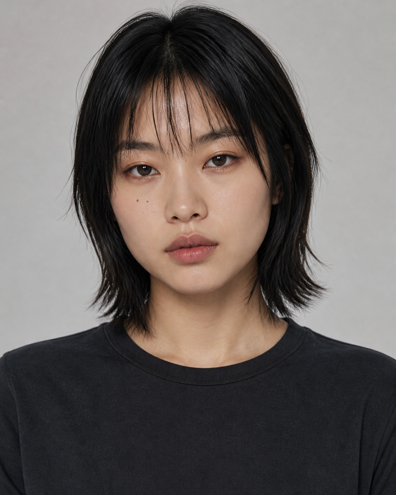
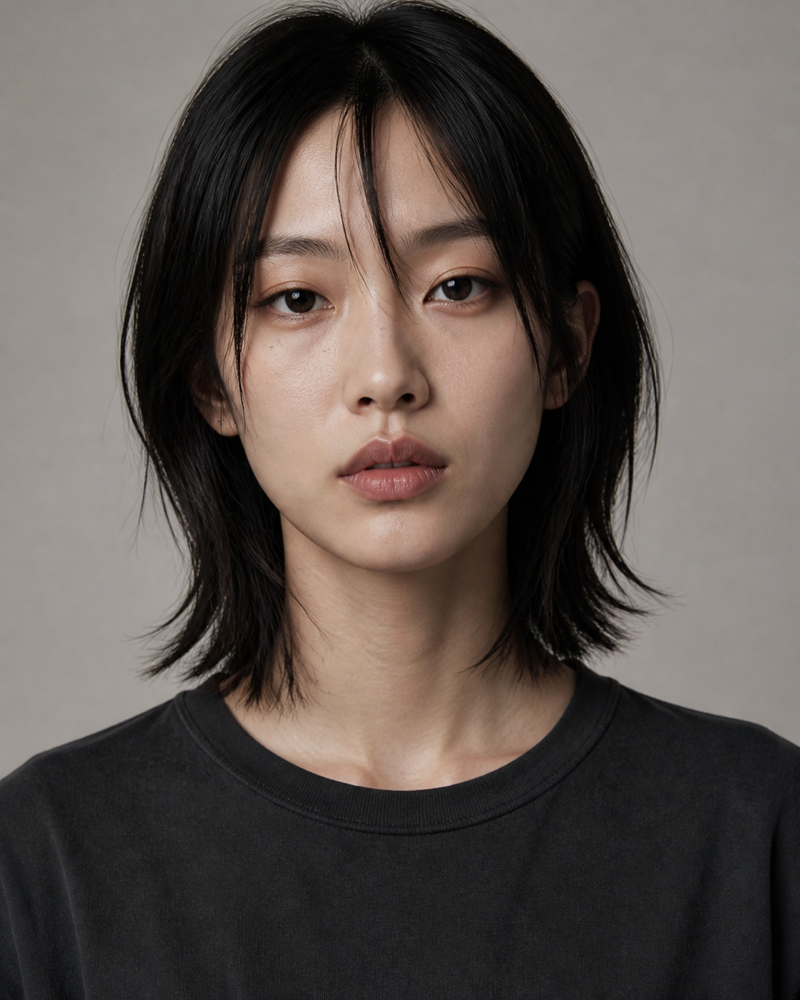

# Casting Round 01

本轮只比较人物脸部结构。三位候选使用相同发型、妆容、服装、背景、光线与镜头语言，避免造型掩盖真实差异。

| A — LINEAR CALM | B — URBAN SCULPTED | C — QUIET ICON |
|---|---|---|
|  |  |  |

## A — LINEAR CALM

- 最接近 `taste.md` 的核心方向。
- 稍长椭圆脸、横向杏仁眼、适中颧骨与平直下颌之间最平衡。
- 高级时装感和商业适用性最好，能够兼容六套主衣橱。
- 当前建议：**首选**。

## B — URBAN SCULPTED

- 脸更短、更宽，颧骨和下颌存在感更强。
- 街头感、年轻感和记忆点最明显，适合偏运动、音乐或潮牌传播。
- 当前图有两个可见面部小痣；若入选，定版时只保留身份锁规定的一颗。
- 当前建议：如果品牌更偏潮流和社交媒体，可优先考虑。

## C — QUIET ICON

- 脸更长、更窄，眼距略开，鼻部和面中纵向感更明显。
- 安静、成熟、疏离，编辑感最强，但运动街头感比 A / B 弱。
- 当前图的刘海更接近中分脸侧发；若入选，定版时恢复主发型的薄碎刘海。
- 当前建议：适合偏建筑、设计、生活方式或高级时装品牌。

## 选择规则

- 选脸，不选当下发丝、痣或细微妆面；这些会在定版时统一修正。
- 不建议把 A 的眼睛、B 的下颌、C 的鼻子继续拼接。选一个完整面孔，跨镜头稳定性更高。
- 选定后生成：正脸、左右 45°、左右侧脸、表情网格、全身基准图和三套主 Look。

