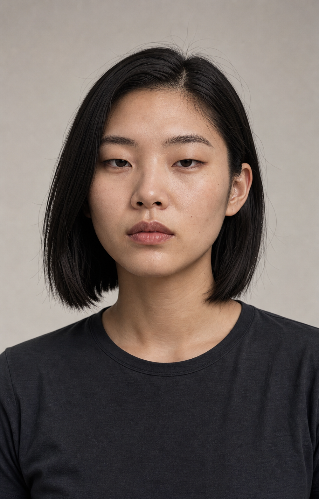
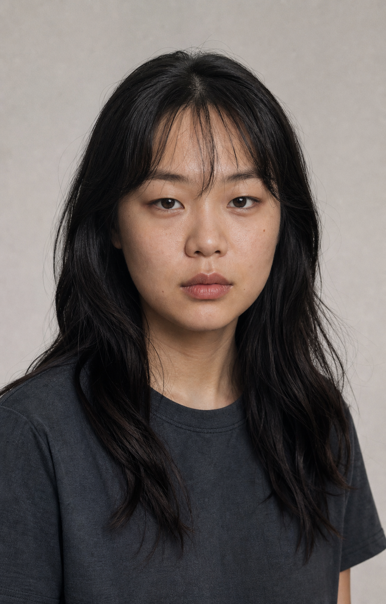

# Casting Round 02 — D / E

> 状态：已被用户淘汰。该轮结构差异过度，偏离 A/C 的精致冷感与时装审美，仅保留为失败记录。

本轮新增两位原创成年女性。二者与 A、C 共享同一品牌审美，但在主要面部结构轴上保持区别。

| D — DIAMOND MONO | E — SOFT SQUARE |
|---|---|
|  |  |

## D — DIAMOND MONO

- 高而横向展开的颧骨，脸部重心偏上。
- 窄长、略接近的厚眼皮杏仁眼，眼神最冷静。
- 鼻梁高度克制，鼻头和鼻翼更宽，避免模板医美鼻。
- 下颌收束但不形成 V 脸，下巴短而平钝。
- 中分锁骨 Bob，没有刘海，整体更图形化、理性、极简。
- 适合方向：黑白棚拍、功能夹克、极简运动、科技产品、冷色建筑空间。

## E — SOFT SQUARE

- 短圆方脸、低颧骨、宽而圆润的下颌转角。
- 眼距明显更宽，眼型平直，神态更松弛。
- 面中较短，鼻头较宽且偏方，嘴宽自然。
- 长黑发配稀薄碎刘海，年轻但不幼态。
- 适合方向：Baby Tee、Cargo、运动球衣、阳光街景、生活方式与群像内容。

## 与现有角色的区别

- A：均衡的长椭圆脸与利落都市感。
- C：更长更窄的脸、纵向面中与成熟编辑感。
- D：高颧骨、窄眼、宽鼻头和图形化冷感。
- E：短圆方脸、宽眼距、低颧骨和松弛生活感。

D 与 E 当前均可进入下一轮多角度身份锁；是否正式加入 `taste.md` 角色阵容，建议先由用户确认。
