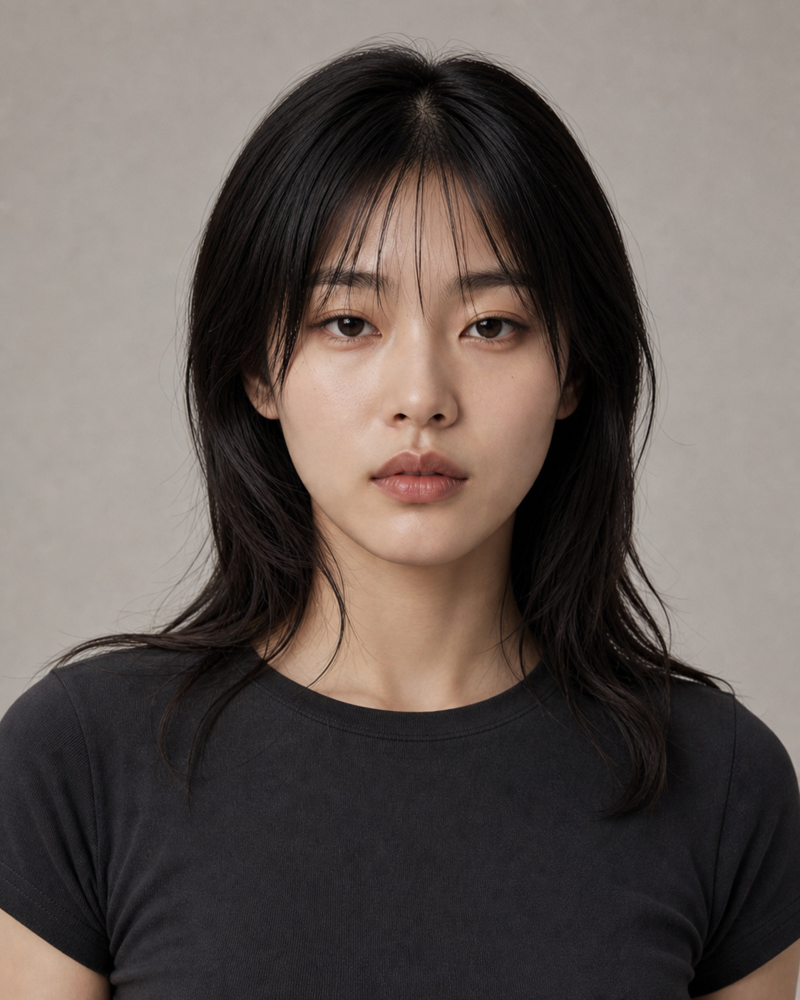

# Casting Round 03 — Replacement D2 / E2

本轮以 A、C 作为颜值、精致度与摄影质感锚点，差异控制在同一审美区间内。

| D2 — SLEEK ARC | E2 — SOFT CURRENT |
|---|---|
|  |  |

## D2 — SLEEK ARC

- 中分锁骨直发，轮廓最干净利落。
- 上庭和上半脸略宽，颧骨平滑，不做强烈外扩。
- 眼型更锐利、内眼角更清楚，整体比 A 更都市、更成熟。
- 鼻唇精致但不过度医美，保留自然成年感。
- 适合：极简黑白、科技产品、功能夹克、冷色建筑与利落运镜。

## E2 — SOFT CURRENT

- 长黑发、自然波纹与稀薄碎刘海，气质更柔和。
- 面中略短，眼距更开，下颌转角比 A/C 更圆润。
- 眼神更安静亲近，但没有甜妹和幼态感。
- 适合：Baby Tee、Cargo、运动支线、日光街景、生活方式与群像。

## 与 A / C 的关系

- A：均衡、利落、年轻，是最通用的主叙事人物。
- C：脸更长、面中更纵向，安静成熟，偏高级编辑感。
- D2：更锐利、更都市、更干净，适合科技与极简方向。
- E2：更柔和、更松弛、更生活化，适合运动与日常方向。

D2、E2 当前只通过颜值与调性审查；用户确认后才进入多角度身份锁。

