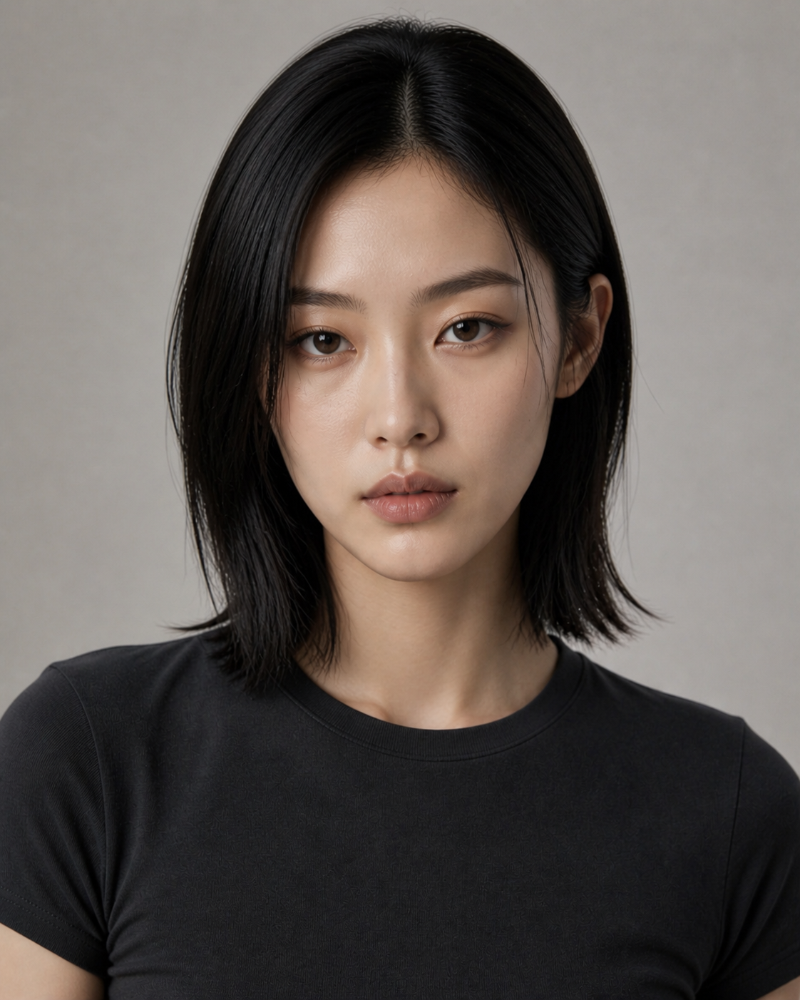
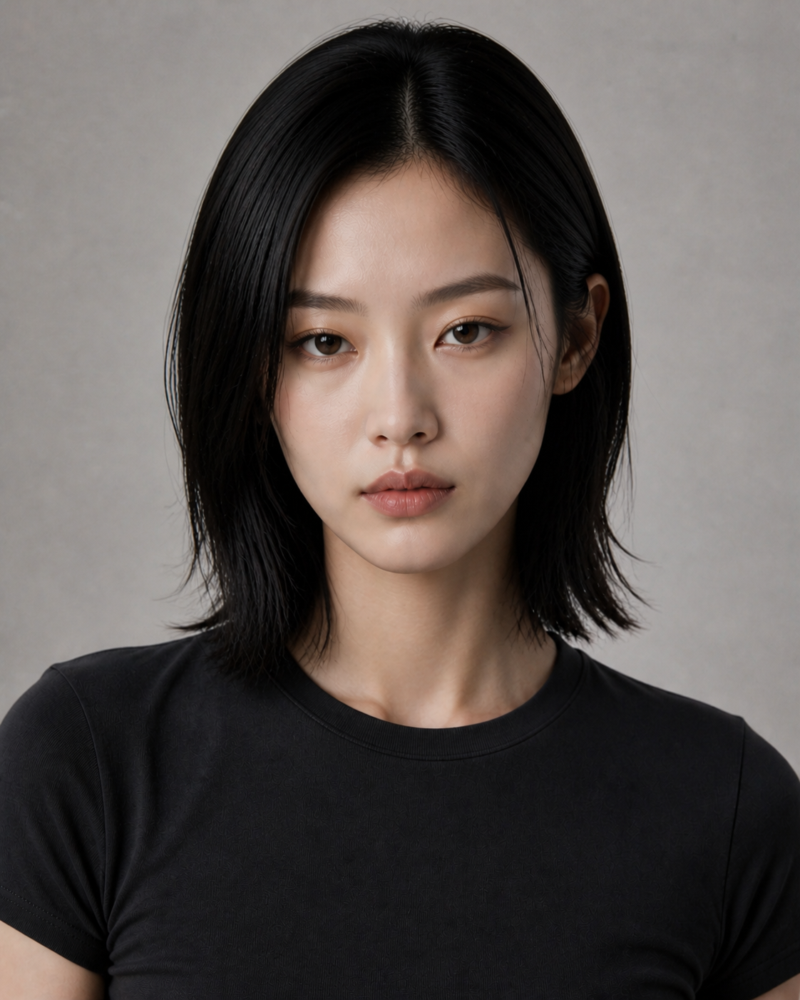
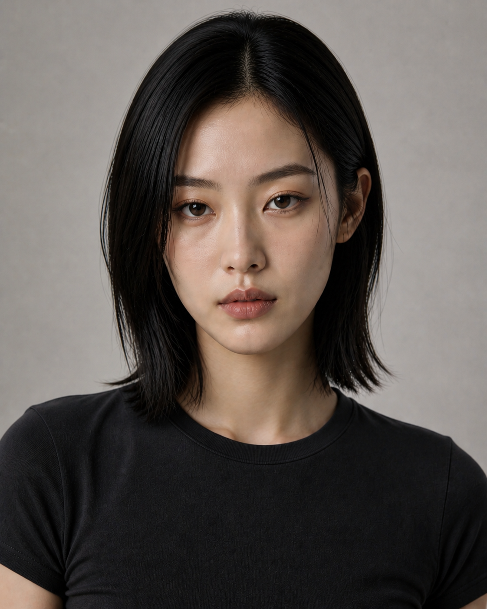

# D2 微调对比｜Round 04

本轮不重新设计人物，只以 D2 为唯一身份底图，测试两种小幅调性调整。

## 原版 D2

## V1｜Editorial Edge

- 眼型更窄长，眉位更低、更平直。
- 下颌和下巴略微加宽、变钝，减少标准 V 脸感。
- 唇妆更克制，整体更冷、更像时装杂志试镜照。
- 适配：科技、潮流、先锋、夜景、冷色品牌片。

## V2｜Natural Current

- 保留原版漂亮度与主要五官关系。
- 增加轻微眉眼不对称、毛孔和肤色细微变化。
- 发梢与碎发更自然，减少棚拍精修感。
- 适配：生活方式、轻运动、城市日常、自然光品牌片。

## 结论

- 若要更有辨识度和冷感：优先 V1。
- 若要更耐看、亲近且适配范围更广：优先 V2。
- 两版均保持 D2 的人物身份，不作为新的独立角色。

