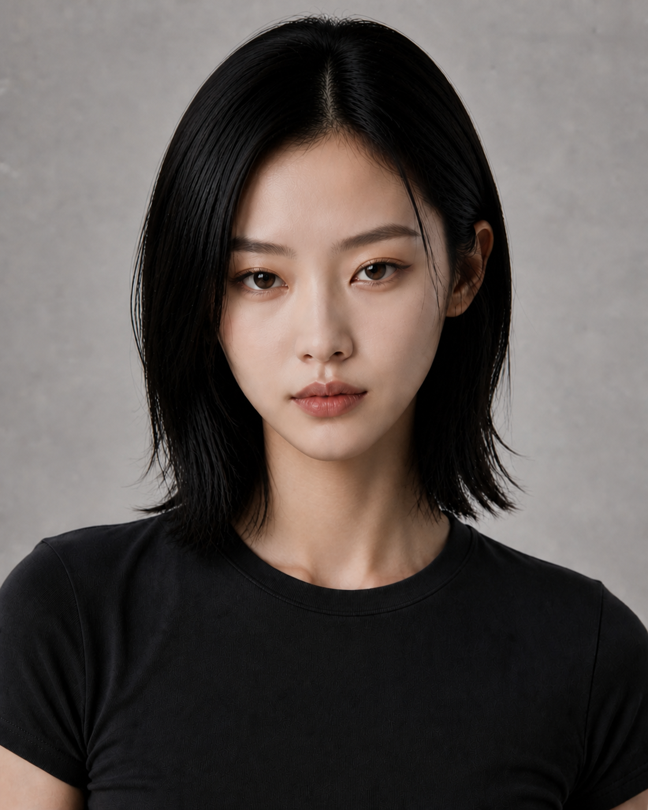

# D2 V3｜Feline Charisma

## 调整目标

在保持 D2 原始身份的前提下，将用户所说的 Jennie 方向抽象为通用人物设计语言，而非复制真人身份：

- 更紧凑的柔和鹅蛋／心形轮廓；
- 上颊与苹果肌略饱满；
- 中等大小、略上挑的猫系杏眼；
- 偏低、平直并自然收尾的眉形；
- 圆润自然的鼻尖；
- 唇中部略饱满，表情冷静但带轻微俏皮感。

## 锁定项

- 同一位原创成年东亚女性，视觉年龄 22–27 岁；
- 同一发型、发色、黑色上衣、灰色背景、正面构图与棚拍光线；
- 不形成任何真实公众人物的可识别复刻或虚假代言。

## QC

- 身份延续：PASS
- 猫系气质：PASS
- 自然高级感：PASS
- 网红化风险：低
- 明星撞脸风险：已通过保留原人物骨架并限制为通用特征进行控制

