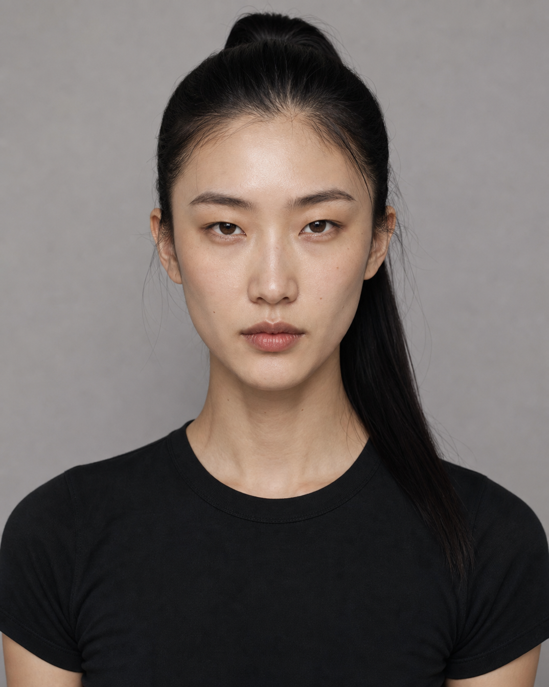

# 亚洲女性四路线选角板｜Round 06

统一标准：18–30 岁亚洲女性、潮酷、高级、自然骨相、非网红脸。统一黑色基础上衣与棚拍背景，用于单独比较人物五官、气质与发型。

## 01｜Rounded Feline Lob

- **脸型**：紧凑圆润鹅蛋脸，颧区和面颊有宽度，下巴短而圆钝。
- **五官**：横向长、纵向窄的猫系杏眼；低平眉；小而圆润的鼻头；集中饱满的嘴唇。
- **发型**：近黑色中分锁骨短发。本组唯一短发。
- **气质**：冷静、俏皮、自持。
- **适配主题**：科技、极简、潮流、美妆、城市夜景。

## 02｜Sleek Signal

- **脸型**：长窄鹅蛋脸，高侧颧骨，较直的下颌线。
- **五官**：窄长重睑眼、低直眉、较长鼻形、上薄下丰的唇形。
- **发型**：露额高马尾，长直发垂至肩后。
- **气质**：理性、锐利、先锋。
- **适配主题**：运动科技、性能产品、未来感、建筑空间。

## 03｜Soft Pulse Y2K

- **脸型**：偏宽的柔和鹅蛋脸，面颊自然饱满，下颌圆润。
- **五官**：自然开阔的杏眼、轻微不对称的直眉、短圆鼻头、偏宽的自然丰唇。
- **发型**：深棕色长波浪发，轻薄不规则刘海。
- **气质**：亲近、年轻、松弛、轻微怪趣。
- **适配主题**：Y2K、轻运动、社交、校园、生活方式。

## 04｜Nocturne Volume

- **脸型**：亚洲宽阔雕塑感鹅蛋脸，外扩颧骨、偏宽下颌、短钝下巴。
- **五官**：深邃窄杏眼、低位有角度的眉形、中低鼻梁、偏宽丰唇。
- **发型**：深黑大侧分长波浪，强发量和流动感。
- **气质**：成熟、磁性、夜间、高对比。
- **适配主题**：香氛、时装、派对、音乐、夜景广告。

## 发型分布

- 短发：1 位
- 扎发／长直发：1 位
- 刘海长卷发：1 位
- 大侧分长波浪：1 位

四人均为亚洲女性；上一轮生成的欧美／混血候选已淘汰，未纳入本选角板。

