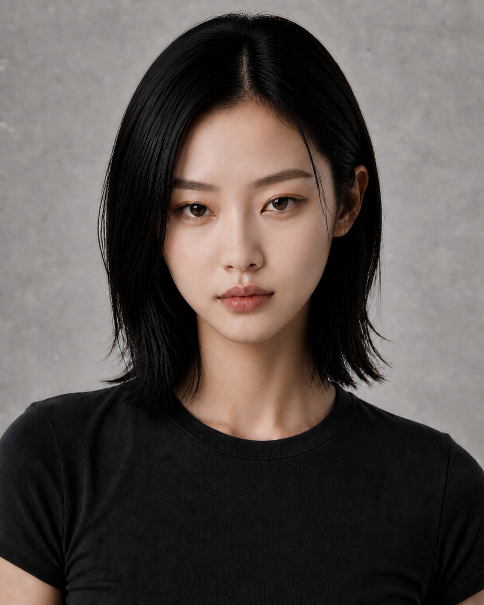
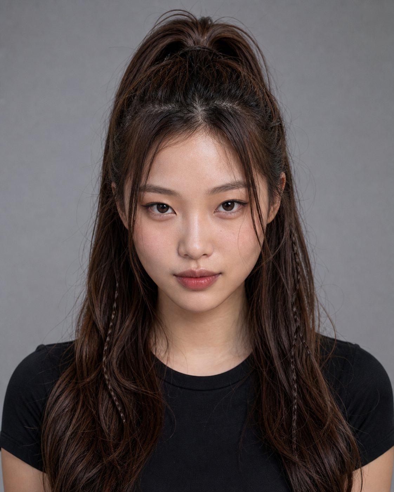

# 亚洲女性五路线选角板｜Round 07

五条路线共享品牌审美底线：18–30 岁成年亚洲女性、潮酷、高级、时尚、真实皮肤、自然骨相、拒绝网红模板脸。每位人物必须通过脸部结构区分，发型和妆容只负责强化气质。

## 01｜清冷极简猫系 / COOL FELINE

- 圆润紧凑鹅蛋脸、自然面颊宽度、短钝下巴。
- 窄长微上挑猫眼、低平眉、小圆鼻头、集中丰唇。
- 近黑中分锁骨短发；五人中唯一短发。
- 适配：科技、先锋、极简、美妆、城市冷色广告。

## 02｜中性先锋 / ANDROGYNOUS SIGNAL

- 长窄鹅蛋脸、高侧颧骨、较直的宽下颌。
- 窄长重睑眼、长直自然鼻、上薄下丰唇。
- 露额高马尾与长直发尾，强调理性和行动感。
- 适配：潮牌、音乐、街头、运动科技、建筑空间。

## 03｜自然长发淡颜 / NATURAL CURRENT

- 偏宽柔和鹅蛋脸、自然饱满面颊、圆润下颌。
- 自然开阔杏眼、短圆鼻头、偏宽的原生丰唇。
- 深棕松散长波浪与轻薄刘海，弱造型感。
- 适配：护肤、生活方式、轻运动、自然光、日常叙事。

## 04｜亚洲浓颜复古夜行 / ASIAN NOCTURNE

- 宽阔雕塑感亚洲鹅蛋脸、外扩颧骨、宽下颌、短钝下巴。
- 深邃窄杏眼、有角度低眉、中低鼻梁、偏宽丰唇。
- 深黑大侧分长波浪，发量与光影对比更强。
- 适配：香氛、派对、时装、音乐、夜景广告。

## 05｜Y2K甜酷少女 / SWEET VOLTAGE

- 紧凑菱心形脸、较宽上颧区、短圆钝下巴。
- 眼距略开、中央较开阔而眼尾上扬的杏眼；轻折眉；短鼻与明显唇峰。
- 冷栗棕长层次半扎发，配两束极细编发；与02的整束高马尾明显不同。
- 适配：年轻社交、校园、轻运动、游戏、潮流消费与短视频广告。

## 发型分布

| 路线 | 发型 | 长度 |
|---|---|---|
| 01 | 中分锁骨 Lob | 短发 |
| 02 | 露额高马尾＋长直发尾 | 长发扎发 |
| 03 | 轻刘海松散长波浪 | 长发自然态 |
| 04 | 大侧分丰盈长波浪 | 长发造型态 |
| 05 | 半扎高马尾＋极细编发 | 长发 Y2K |

当前均为候选角色。用户确认前，不制作侧脸、全身与视频身份锁。

