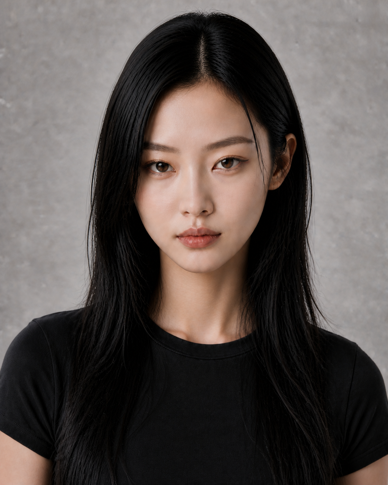
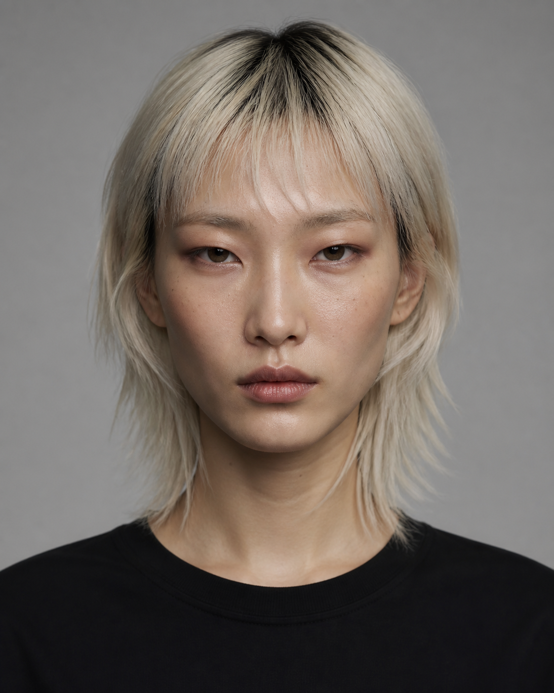
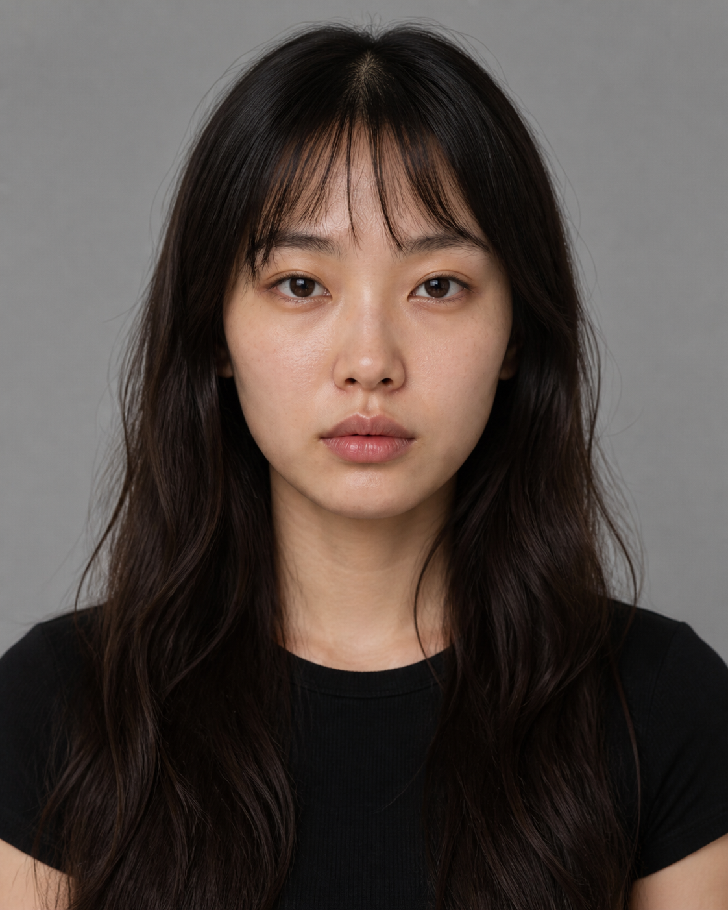
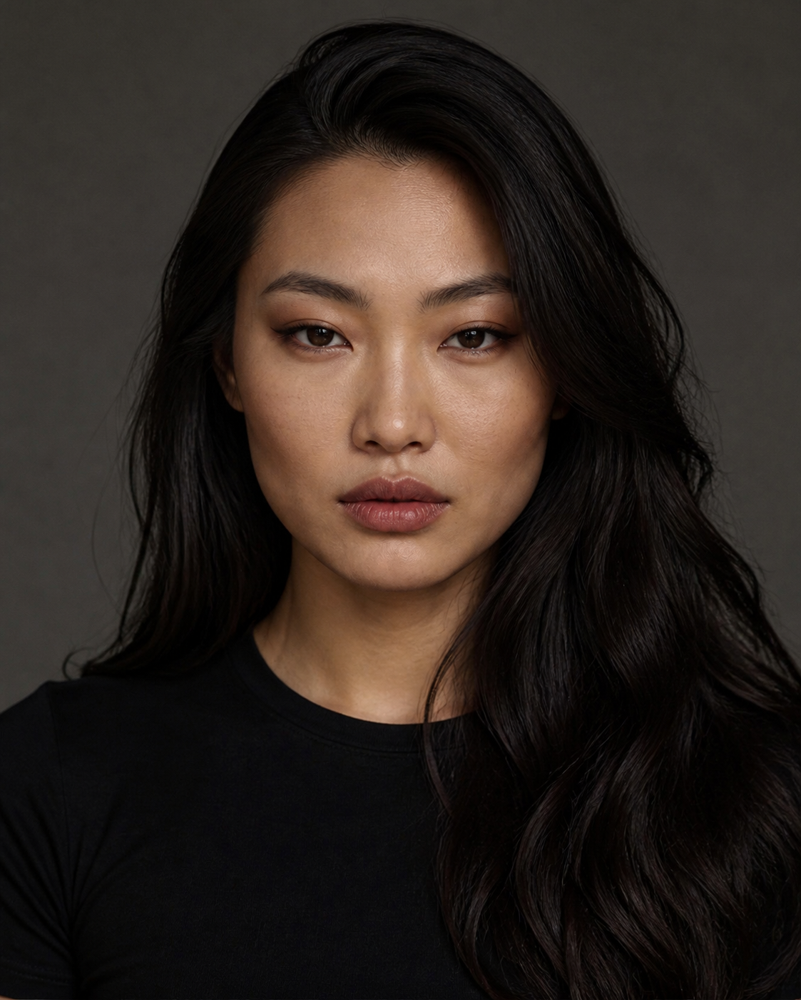
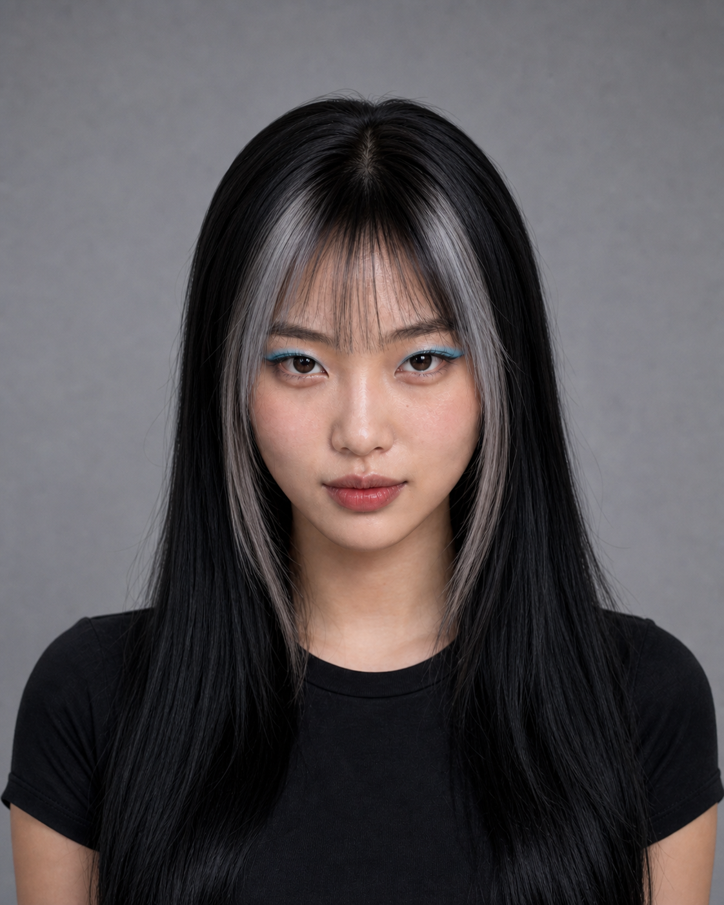

# 亚洲女性五路线｜参考映射版 Round 08

本轮按照用户最新指定的参考分组重新校正人物。所有参考仅提取五官结构、妆发和气质规律，不复制现实人物身份。

## 01｜清冷极简猫系

参考：图1、图2。

- 图1：圆润紧凑脸、猫系眼神、长直黑发和克制气质。
- 图2：碎层发丝、冷感与年轻时装态度。
- 当前候选：保留圆润猫系身份，主发型改成长直黑发；不再占用短发路线。
- 适配：科技、先锋、极简、美妆、城市冷色广告。

## 02｜中性先锋

参考：图3、图4、图6。

- 图3：长窄脸、低眉眼距离、清晰下颌。
- 图4：横向拉长眼型、颧骨张力和克制浓度的灰棕眼妆。
- 图6：地下感、银灰发色、短层次与直视镜头的态度。
- 当前候选：长矩形鹅蛋脸、宽直下颌、窄长重睑眼、深色发根的银灰 Wolf-Lob。
- 适配：潮牌、音乐、街头、运动科技、建筑空间。

## 03｜自然长发淡颜

参考：图5、图7。

- 图5：正面自然比例、长黑发、低妆感和健康肤色。
- 图7：原生肤质、长波浪、轻薄刘海和自然厚唇。
- 当前候选与方向一致，本轮不换脸。
- 适配：护肤、生活方式、轻运动、自然光与日常叙事。

## 04｜亚洲浓颜复古夜行

本轮未收到专属参考，暂时保留上一版候选。

- 当前候选：宽阔亚洲骨相、深邃窄眼、大侧分丰盈长波浪。
- 适配：香氛、派对、时装、音乐与夜景广告。
- 状态：等待后续专属参考后再决定是否调整。

## 05｜Y2K甜酷

参考：图8。

- 图8：黑银长直发、轻薄刘海、蓝色横向眼妆和冷调Y2K能量。
- 当前候选：保留原创菱心形脸，改为黑色长直发、银灰脸侧挑染和克制蓝色眼妆。
- 去除参考中的具体发夹、首饰、服装与品牌元素。
- 适配：年轻社交、游戏、潮流消费、校园与短视频广告。

## 未分配参考

图9尚未指定路线，已保存为 `../reference-faces-v2/ref-09-unassigned.png`，当前不参与任何人物生成。

