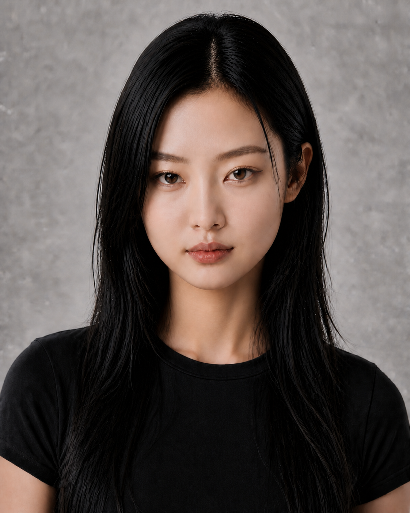
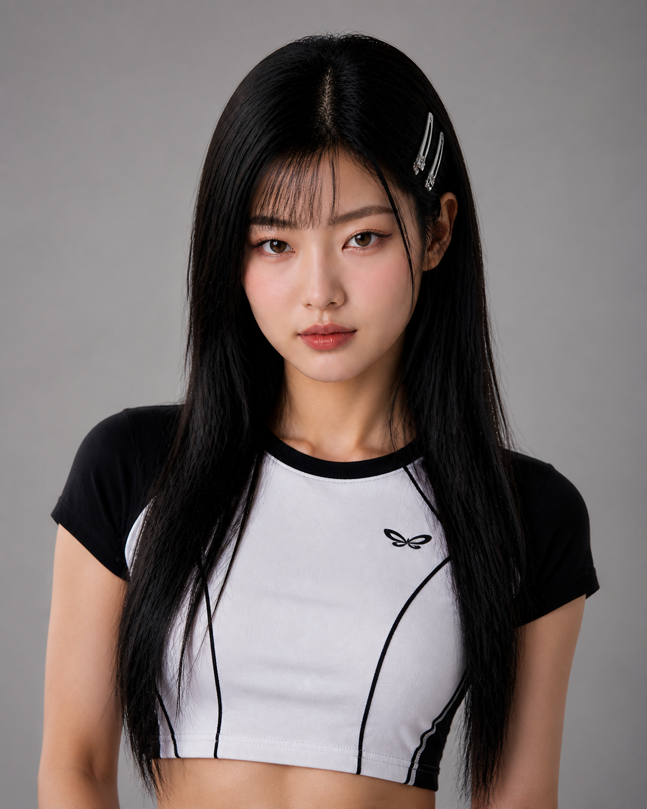

# 三人物原型＋Y2K造型模块｜Round 09

本轮根据用户反馈将“人物身份”与“主题造型”拆开。04人物淘汰；Y2K不再占用一个独立脸型，而是作为可叠加在获批角色上的服饰、妆容与发型模块。

## Character 01｜清冷极简猫系

- 紧凑圆鹅蛋脸，中央和下部面颊有自然宽度。
- 下庭短，下颌不过度内收，下巴为短、宽、圆钝的浅 U 形。
- 窄长微上挑猫眼与圆润外轮廓形成反差。
- 长直自然黑发、克制淡妆。
- 适配：科技、先锋、极简、美妆、城市冷色广告。

## Character 02｜中性先锋

- 长矩形鹅蛋脸、高侧颧骨、宽直下颌、长钝下巴。
- 窄长重睑眼、低直眉、较长自然鼻。
- 深色发根的银灰 Wolf-Lob。
- 适配：潮牌、音乐、街头、运动科技、建筑空间。

## Character 03｜自然长发淡颜

- 宽柔和鹅蛋脸、自然满颊、圆润下颌。
- 自然开阔杏眼、短圆鼻头、原生丰唇。
- 轻刘海、松散深棕长波浪、低妆感。
- 适配：护肤、生活方式、轻运动、自然光叙事。

## Styling Module｜Y2K甜酷

同一Character 01，未新增人物身份：

- **服饰**：黑白撞色 Ringer Baby Tee、运动弧形拼接、小型原创抽象图形；不复制参考品牌文字。
- **妆容**：粉调眼影、极细横向猫眼线、冷玫瑰腮红、缎光粉唇。
- **发型**：保留长直黑发和原发际线，增加轻薄刘海、脸侧发丝与简洁金属发夹。
- **气质**：年轻、甜酷、运动、早期数码时尚感。
- **可叠加对象**：优先Character 01，也可在身份锁确认后测试Character 03。

## 状态变化

- 04 亚洲浓颜复古夜行：用户否决，退出有效候选。
- 原05 Y2K人物：取消独立身份；Y2K并入造型系统。
- 当前有效人物原型：01、02、03。

