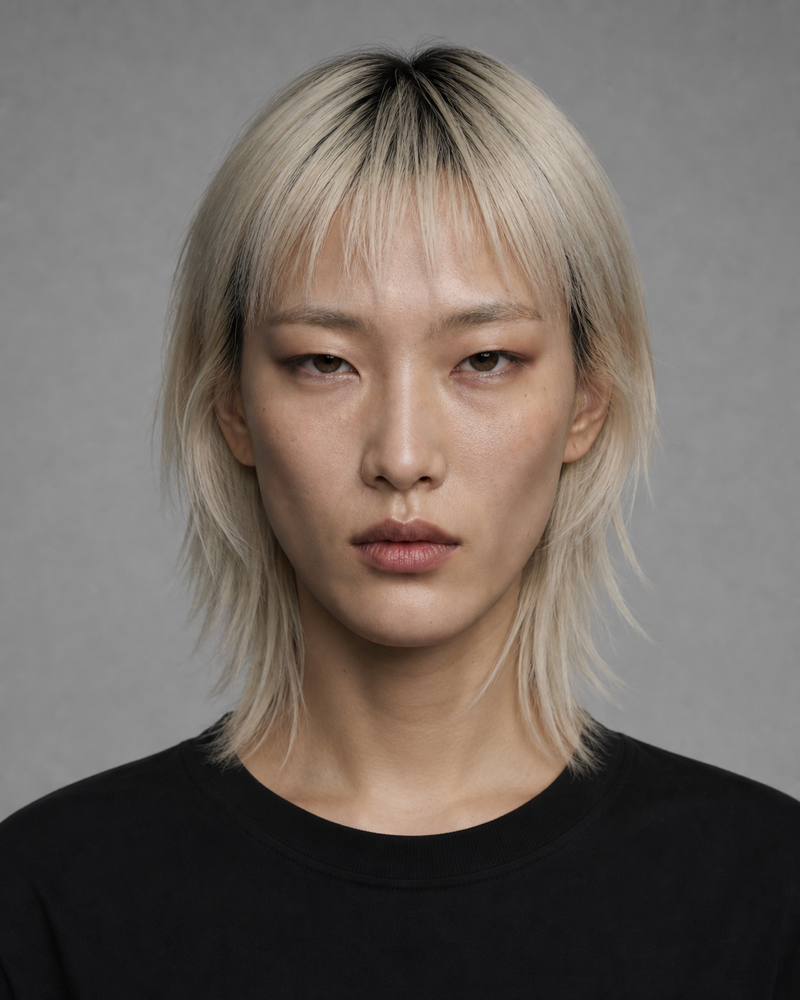
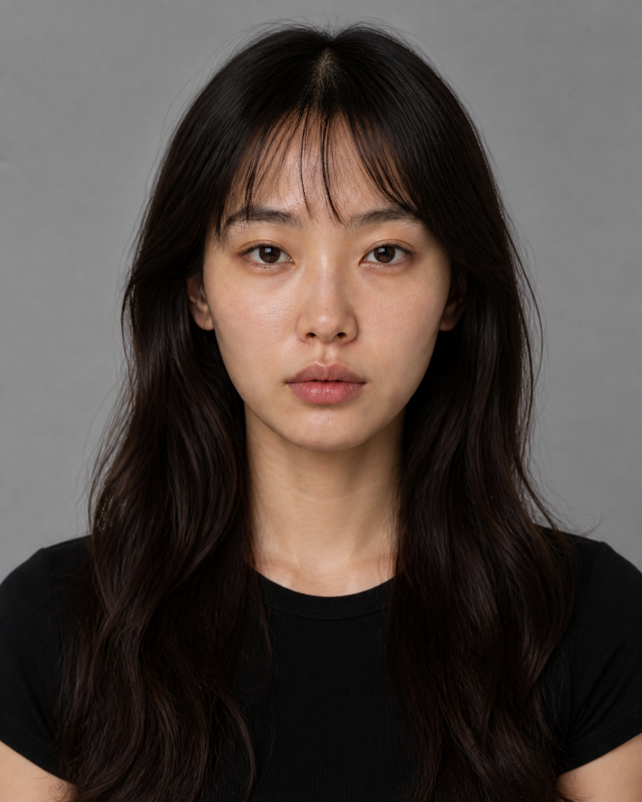

# Round 11 — Structural Roster

本轮使用统一灰色背景、黑色圆领上衣、正面视角、克制妆容和接近的摄影条件，验证人物差异是否来自骨相结构。

| 01 COOL FELINE | 02 ANDROGYNOUS SIGNAL | 03 NATURAL CURRENT |
|---|---|---|
|  |  |  |
| 短而紧凑的圆鹅蛋脸；短中庭；柔软满颊；略宽眼距的窄长猫眼；短宽浅 U 形下巴 | 长矩形鹅蛋脸；中长中庭；高侧颧骨；宽直下颌；窄长重眼睑；长而钝的下巴 | 中等偏长柔和椭圆脸；中等中庭；低位柔和颊区；较开阔杏眼；自然收窄下颌与中宽圆下巴 |

## Casting intent

- 01：冷感、贵气、慵懒，适合科技、先锋、极简与美妆。
- 02：理性、中性、建筑感，适合潮牌、音乐、街头与运动科技。
- 03：自然、安静、亲和，适合护肤、生活方式、轻运动与自然光叙事。

三位当前均为正面候选。只有人工确认后，才进入 45°、侧脸、表情与全身身份板。

