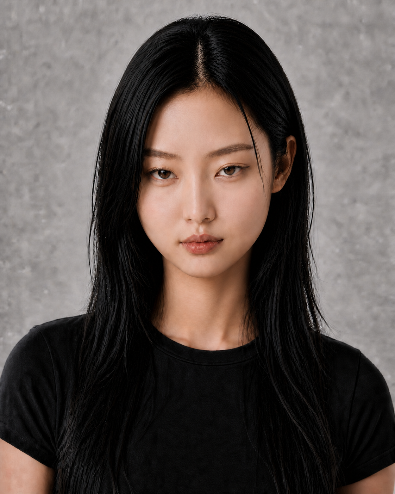
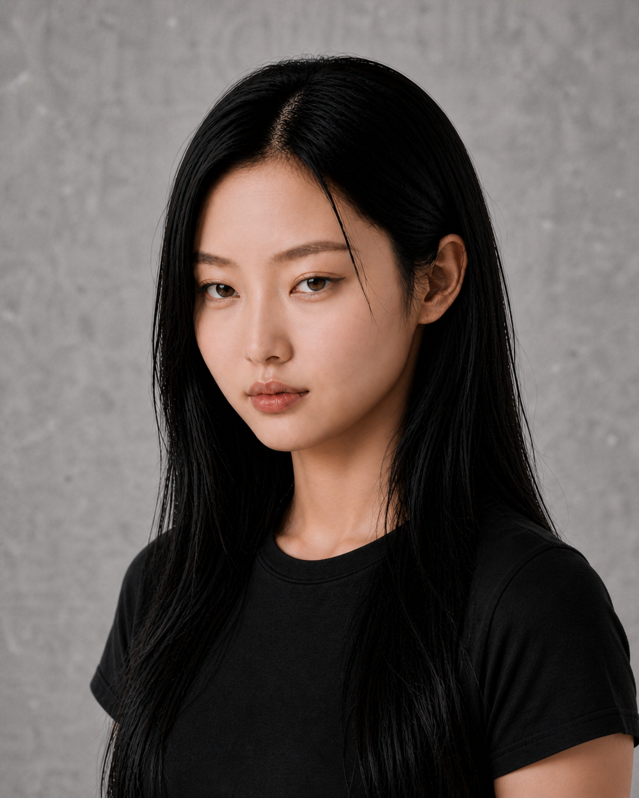
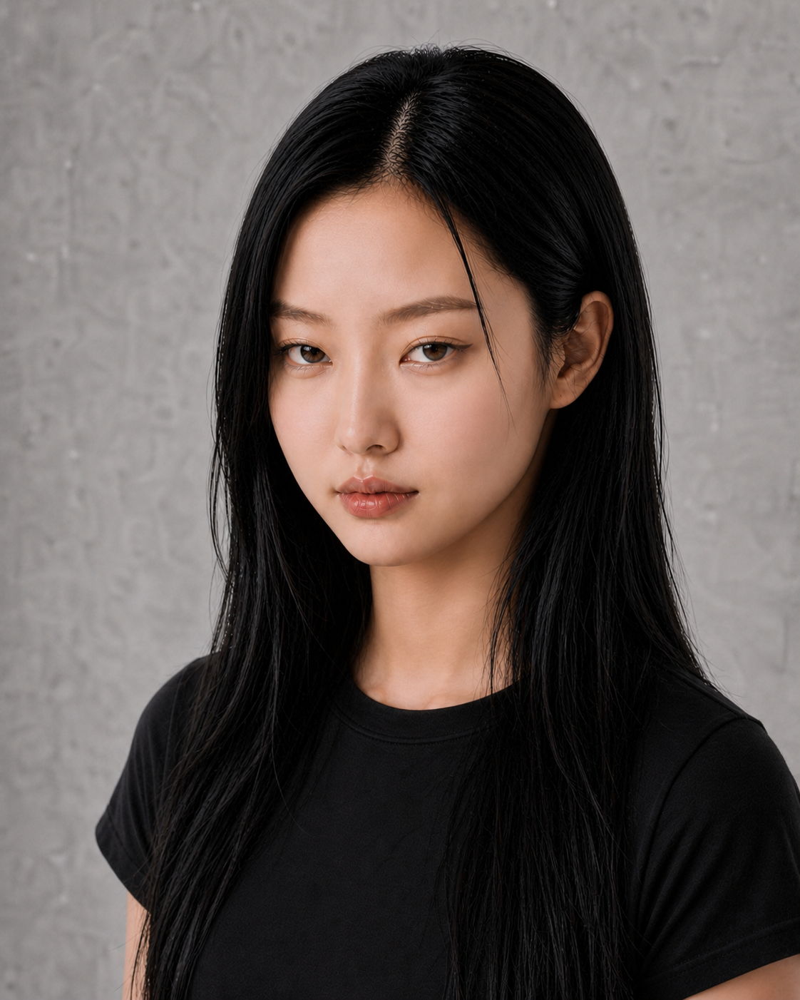
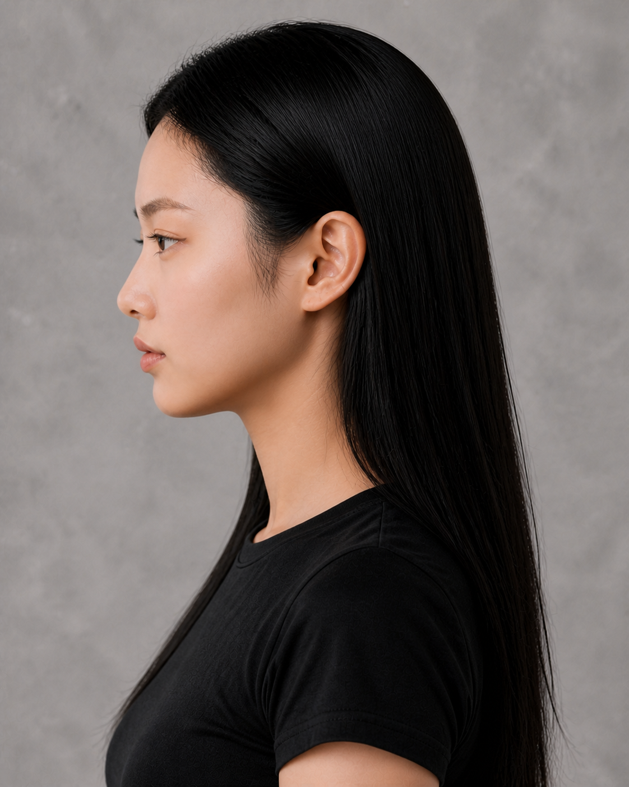
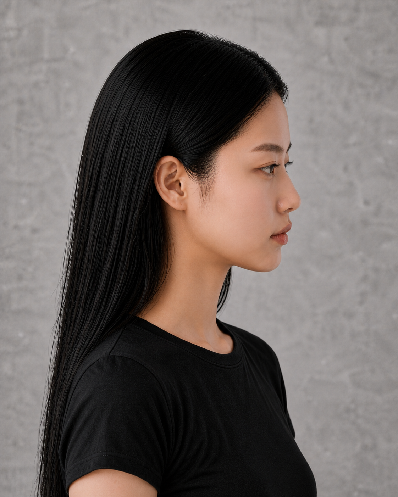

# Character 01 — Multi-angle Identity Board

## Canonical front and three-quarter views

| Front | Left 45° | Right 45° |
|---|---|---|
|  |  |  |

## Profiles

| Left profile | Right profile |
|---|---|
|  |  |

## Identity markers under review

- 紧凑短圆鹅蛋脸与柔软满颊。
- 短中庭、低至中等自然鼻梁、圆鼻头。
- 略宽眼距的窄长猫眼与压低上眼睑。
- 宽柔下颌与短宽圆钝下巴，无中央尖点。
- 长直黑发、同一发际线、同一成年年龄感。

