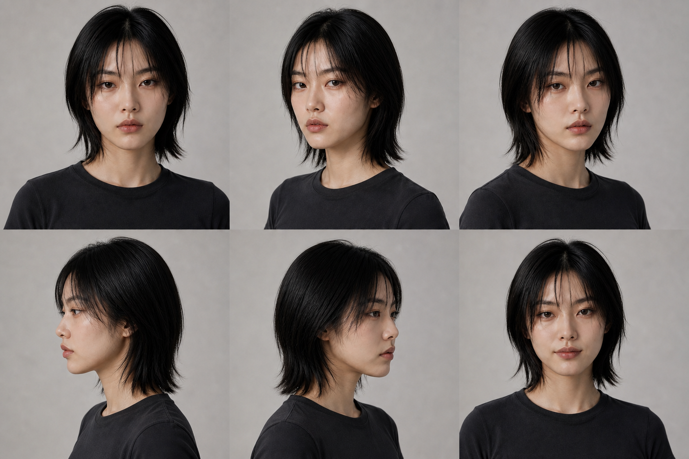
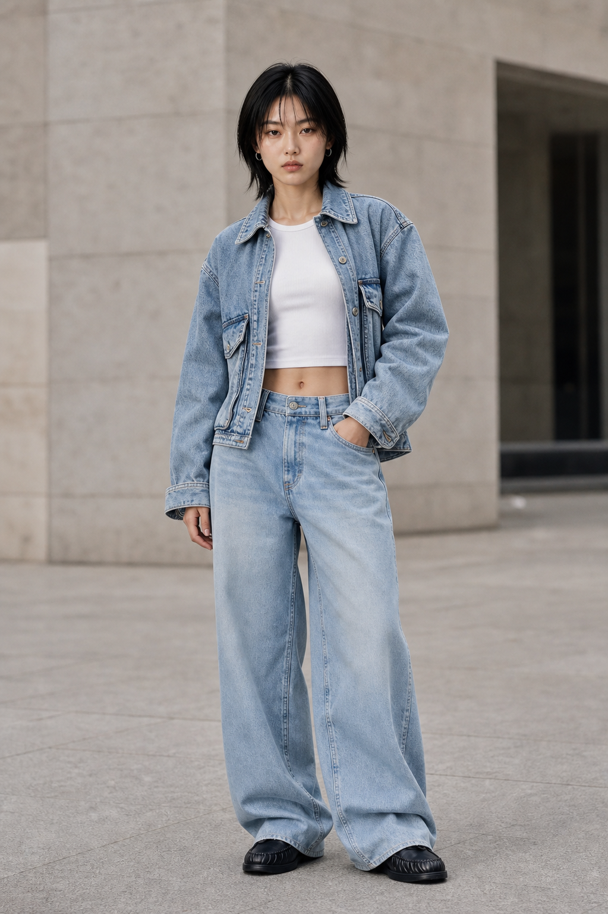
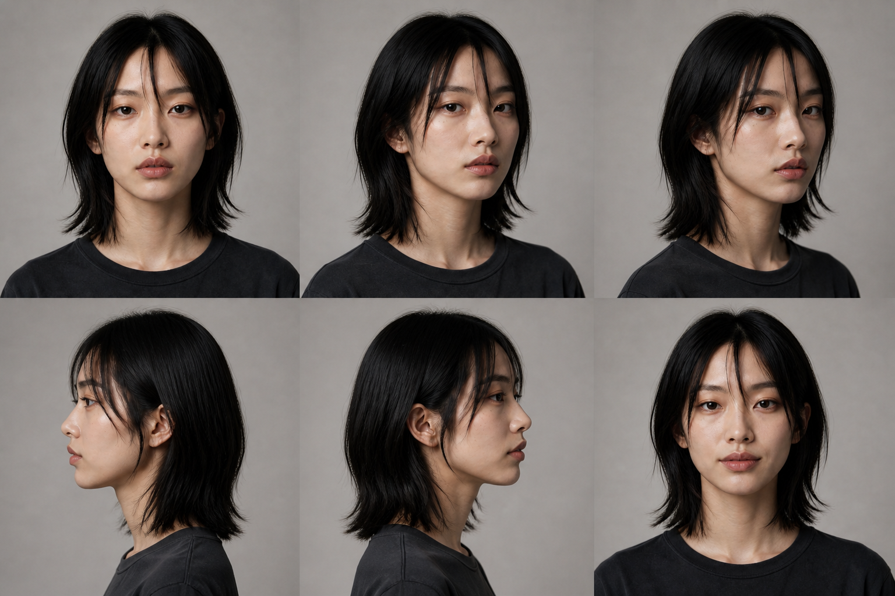
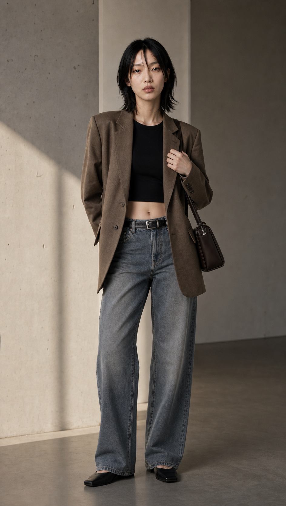

# Dual Character Roster

## A — LINEAR CALM

- Role: primary audience-entry character
- Tone: youthful, direct, cool, mobile, approachable
- Best wardrobe: denim, navy sportswear, ringer tees, blue cargo and brand athletics
- Best scenes: city daylight, walking, product interaction, faster editorial movement

## C — QUIET ICON

- Role: premium editorial counterpoint
- Tone: mature, quiet, distant, architectural
- Best wardrobe: tobacco or charcoal blazer, black fitted base, restrained denim
- Best scenes: minimal architecture, long shadows, still framing, profiles and slow push-ins

## Production rule

A and C are two separate original characters. Never treat them as interchangeable versions of one identity. Use the matching identity sheet as the primary reference for every dependent render.

