# BRAND FILM TASTE — CHARACTER & WARDROBE DNA / 人物与穿搭篇

> 版本：v0.10（女性五路线 + 男性五路线，独立人物体系）  
> 用途：仅依靠本文件完成品牌广告人物选型、AI 人物生图、妆发与穿搭生成；也可作为后续视频人物一致性基础。  
> 当前范围：本文件已经可以脱离原始参考图和当前聊天独立使用。它定义原创亚洲成年女性与男性的人物结构、妆发、面部影像质感、服装体系、提示词拼装方式与验收标准。空间、美术、整体色彩和完整运镜不属于本次人物链路测试范围。

## 0. 使用原则

本文件提取用户已提供的脸部、发型、妆容与穿搭参考之间的**共同审美语言**，用于设计一组原创虚构人物及其可复用衣橱；它不是对任何单张参考图、现实人物或现成品牌 Look 的复刻。

生成顺序：

1. 路线测试先生成一张无造型干扰的正面胸像，确认脸型与五官方向。
2. 人工确认后，将该角色写成「不可变身份锁」，再补左右 45°、侧脸与全身基准。
3. 身份通过后再加入主题发型、妆容和服装；宣传片所有镜头沿用同一组获批基准图。
4. 不要每个镜头重新混合参考图；更换发型时也不得改变发际线、脸型、眼鼻唇比例和年龄感。

### 0.1 可复用结构混合方法 / STRUCTURAL BLEND METHOD

人物设计不复制某位现实人物的整张脸，也不把全部参考平均成一张脸。每个原创角色先确定广告主题所需的气质，再从以下七个结构轴单独组合：

1. **外轮廓**：脸部长宽比、颧区宽度、下颌收束速度、下巴宽度与底部弧度。
2. **眼部**：眼裂长宽比、眼距、眼尾角度、眼睑重量与视线气质。
3. **纵向比例**：上庭、中庭、下庭的相对长度；成年感不能因缩短中庭而变成幼童感。
4. **鼻部**：鼻梁高度与宽度、鼻头体量、鼻翼自然度；优先自然普通结构，避免医美模板。
5. **口唇**：唇宽、上下唇厚度关系、唇峰、嘴角趋势与静止张力。
6. **真实质感**：毛孔、肤色细微变化及 2%–4% 的自然左右不对称。
7. **情绪气质**：冷、甜、野、静、贵气等属于表达层，不能代替骨相设计。

每位新人物至少在三个结构轴上与其他人物形成明确差异。发型、妆容、服装、首饰、灯光和主题造型是独立模块，不计入人物身份差异。真人或明星参考只能拆解为非身份化的通用结构语言，不得追求真人相似度。

结构生成顺序：`主题气质 → 外轮廓 → 纵向比例 → 眼部 → 鼻部 → 口唇 → 真实质感 → 发型与造型`。每次迭代只改变一至两个轴，其他身份变量必须锁定。

### 0.2 单文件调用协议 / PORTABLE GENERATION PROTOCOL

调用本文件时不要求访问参考图、候选图、历史聊天或任何外部人物图片。文件中的图片链接仅为本次链路验证记录；生成模型必须优先执行本节文字规范。

#### 最少输入

用户只需提供以下任意一项：

- 广告主题，例如：`科技极简`、`街头音乐`、`护肤生活方式`、`Y2K年轻社交`；
- 或直接指定人物路线：女性使用 `F01`–`F05`，男性使用 `M01`–`M05`；
- 可选补充：人物体系、年龄、景别、表情、发型变化、妆容模块、LOOK 编号和场景。

未提供年龄时默认生成 **22–28 岁的亚洲成年人**；未提供人物体系时按用户描述判断，完全未指定则默认女性体系；未提供路线时按广告主题在对应体系内自动选择；未提供造型时采用对应路线的基础妆发与最匹配的一套 LOOK。女性与男性路线是两套独立选角，不能把 `F01` 直接性别转换为 `M01`。

#### 自动选角

| 广告主题关键词 | 女性默认路线 | 男性默认路线 | 默认造型方向 |
|---|---|---|---|
| 科技、未来、极简、美妆、设计、冷色城市 | F01 CLEAN MINIMAL | M01 COOL INTELLECT | 干净深色发型、近乎裸妆、BLACK RINGER 或 EDITORIAL BLAZER |
| 潮牌、音乐、街头、建筑、运动科技 | F02 ANDROGYNOUS SIGNAL | M04 URBAN SHARP | 低饱和层次发、NAVY URBAN 或 EDITORIAL BLAZER |
| 护肤、生活方式、旅行、自然光、轻运动 | F03 NATURAL CURRENT | M03 NATURAL EASE | 松散自然发型、近乎裸妆、HERO DENIM 或 BLUE CARGO ACCENT |
| 高级时装、珠宝、香氛、美妆、精致编辑感 | F04 MODERN STATEMENT | M02 SOFT REFINED | 清晰但克制的五官修饰、EDITORIAL BLAZER |
| 年轻社交、游戏、运动、明亮潮流、短视频 | F05 PLAYFUL EDGE | M05 YOUTHFUL ENERGY | 轻盈层次发型、BRAND ATHLETICS 或 Y2K RINGER |
| Y2K、复古运动、成年校园氛围 | 优先 F05 | 优先 M05 | 叠加 Y2K RINGER MODULE；Y2K 只改变妆造，不重新设计脸 |

#### 提示词拼装顺序

每次生成先选择**女性或男性人物体系**，再从该体系选择**一条**人物路线，按以下顺序组合；不得跨体系混脸，也不得同时混合多条路线：

```text
[7.1 共享母提示词]
+ [7.2女性路线 或 7.3男性路线中选中的完整结构追加词]
+ [第4节对应发型]
+ [第5节基础妆容；如需主题则叠加7.4]
+ [10.9选中的LOOK或10.10穿搭模块]
+ [7.5镜头变量]
+ [第8节负面提示词]
```

#### 直接交给生成模型的任务模板

```text
请严格依据本 taste.md 生成 1 位原创亚洲成年人，不复制任何现实人物或明星身份。
广告主题：{主题}
人物体系：{AUTO / WOMAN / MAN}
人物路线：{AUTO / F01 / F02 / F03 / F04 / F05 / M01 / M02 / M03 / M04 / M05}
年龄：{默认22–28岁}
妆造模块：{基础 / Y2K / 极简 / 街头 / 自然}
服装：{LOOK编号或AUTO}
景别与角度：{默认正面胸像，85–105mm人像视角}
表情：{默认平静直视，情绪强度25%}
场景：{默认中性灰色摄影棚}

先按0.2选择人物体系与路线，再拼装7.1、选中的女性或男性结构锁、对应妆发、服装、7.5和第8节。只输出一位人物。人物差异必须来自骨相结构，不得只靠发型、妆容或服装。保留真实皮肤、轻微不对称和成年感。若结果出现尖下巴、大圆眼、高鼻网红脸、明星相似或非亚洲混血外观，则视为失败并按原路线定向重试一次。
```

#### 输出要求

- 默认一次只生成一位人物、一个角度、一个明确造型。
- 用户要求“不同人物”“不同女生”或“不同男生”时，应在对应人物体系内改变至少三个结构轴；不能只换头发或衣服。
- 只测试人物链路时，输出一张正面胸像即可；多角度、全身与表情板不是必需交付。
- 只有当人物要进入连续视频制作时，才执行第9节的多角度身份锁流程。

---

## 1. 品牌人物矩阵

**一组 18–30 岁的原创亚洲成年人：女性与男性各自拥有五条独立路线。两套体系不做逐条性别翻版，但共同保持潮酷、高级、时尚、真实皮肤与非网红模板感。**

人物多样性服务于不同广告主题，不把全部参考图平均成同一张脸。每个人物原型独立建立正脸、45°、侧脸和全身身份锁；发型、妆容和穿搭不能代替骨相差异。

### 1.1 女性五条人物路线 / F01–F05

| 路线 | 可选验证图（生成不依赖） | 结构关键词 | 发型 | 适配广告主题 |
|---|---|---|---|---|
| F01 清冷极简 / CLEAN MINIMAL |  | 紧凑但不过分幼态的圆鹅蛋或柔和椭圆脸、短至中等中庭、克制窄长眼、自然低中鼻梁、干净轮廓 | 中分长直黑发或锁骨直发 | 科技、先锋、极简、美妆、设计、冷色城市 |
| F02 中性先锋 / ANDROGYNOUS SIGNAL |  | 长矩形鹅蛋脸、中长中庭、高侧颧骨、宽直下颌、窄长重眼睑 | 深色发根银灰 Wolf-Lob | 潮牌、音乐、街头、运动科技、建筑 |
| F03 自然淡颜 / NATURAL CURRENT |  | 中等偏长柔和椭圆脸、中等中庭、低位柔和颊区、开阔杏眼、自然偏宽鼻 | 轻刘海松散长波浪或锁骨自然发 | 护肤、生活方式、轻运动、自然光叙事 |
| F04 摩登浓颜 / MODERN STATEMENT | 文字规范，生成不依赖验证图 | 清晰颧区与眉眼结构、中等偏长脸、深邃但自然的眼睛、明确鼻唇体量、成熟自信 | 利落长直发、大弧度侧分或低位盘发 | 高级时装、珠宝、香氛、美妆、都市社交 |
| F05 灵动甜酷 / PLAYFUL EDGE | 文字规范，生成不依赖验证图 | 短至中等脸、短中庭、较开阔杏眼、清晰唇形、轻盈敏捷的表情张力；成年而不幼态 | 长直层次发、轻薄刘海、高马尾或半扎 | 年轻社交、游戏、轻运动、Y2K、明亮潮流、短视频 |

### 1.2 男性五条人物路线 / M01–M05

| 路线 | 结构关键词 | 基础发型 | 适配广告主题 |
|---|---|---|---|
| M01 清冷智性 / COOL INTELLECT | 中等偏长的紧致椭圆脸、轮廓清楚但不过度硬朗、冷静窄杏眼、整洁眉骨、自然直鼻、克制唇形；聪明、疏离、可信 | 黑色中短层次、轻侧分或低体积后梳 | 科技、眼镜、设计、智能产品、极简时装、专业内容 |
| M02 柔美精致 / SOFT REFINED | 偏窄的柔和椭圆脸、平滑颧颊、柔和收束下颌、细长温柔眼型、纤细自然鼻、较清晰的唇部体量；优雅但不女性化扮演 | 自然黑、深棕或克制浅金的中长羽毛层次 | 护肤、美妆、珠宝、香氛、轻奢、无性别时装 |
| M03 自然松弛 / NATURAL EASE | 中等柔和椭圆脸、较自然的颊区和下颌宽度、平静杏眼、普通偏宽鼻、放松嘴唇；健康、亲近、未经刻意雕琢 | 黑色或深棕中长自然波纹、风动层次 | 旅行、户外、生活方式、健康、家居、自然光叙事 |
| M04 都市利落 / URBAN SHARP | 中等偏长脸、较清楚的眉骨与直下颌、略深的杏仁眼、较强直鼻、稳定口唇；成熟、果断、有城市行动感 | 深色短至中短碎层、湿感纹理或利落侧分 | 潮牌、音乐、街头、运动科技、交通、都市夜景 |
| M05 年轻活力 / YOUTHFUL ENERGY | 紧凑柔和的棱角椭圆脸、中短中庭、灵活窄杏眼、自然直鼻、略饱满嘴唇；轻盈、有反应、成年而不幼态 | 黑、深棕或灰棕的轻碎层、轻狼尾或风动短发 | 社交、游戏、运动、饮料、数字产品、Y2K、短视频 |

### 1.3 使用规则

- 女性五条与男性五条共同属于同一品牌世界，但每条都是独立原型，不是同一个人换发型，也不是男女互相换性别。
- 同一连续段落固定角色，不在动作中无原因换脸。
- 普通单张人物生成只需使用对应路线文字规范；需要连续视频时，每位角色再单独建立正脸与多角度身份板，不能共用同一身份 seed。
- 群像镜头先完成每位角色的单人全身基准，再生成多人画面。
- 文件内现有图片仅记录方法测试结果，不是调用本文件的必要输入，也不限制未来生成新面孔。
- F01 的多角度候选板仅证明身份保持链路可执行，不属于本次单文件人物生成交付要求。
- Y2K、运动、夜景、派对等首先作为可叠加的妆造与服饰模块，不默认新增一张脸。
- F04 的旧候选图已被否决，但“摩登浓颜”路线保留并以新文字规范重新建立；不沿用旧脸。
- F05 保留“灵动甜酷”独立骨相；Y2K同时作为可叠加的造型模块，二者不能混为一谈。
- M02 原“中性先锋”命名废弃，改为“柔美精致”：重点是柔和、精致、轻盈的男性面部结构，不把金发、浅瞳或混血感当作身份条件。

### 共享气质底线

- 潮酷而不装腔，高级而不名媛，年轻而不幼态。
- 情绪克制、自然、不经意；Y2K造型模块可以具有更明亮的活力。
- 可以甜酷、浓颜、中性或淡颜，但禁止女团／男团舞台模板、性感网红感、油腻商务感和商业式大笑。

### 关键词

`亚洲年轻群像` `潮酷` `自然高级` `时装编辑感` `结构差异` `真实皮肤` `非网红脸` `主题适配`

### 不要的气质

`幼态` `女团或男团偶像模板` `热情商业笑容` `精致名媛` `油腻商务男` `健身网红` `性感网红` `病娇` `刻意厌世` `廉价朋克` `多个角色共用同一张脸`

---

## 2. 参考图合并逻辑

女性首批九张图片不按“平均脸”直接混合，而是分别提取最有效的视觉维度：

| 01 | 02 | 03 |
|---|---|---|
| 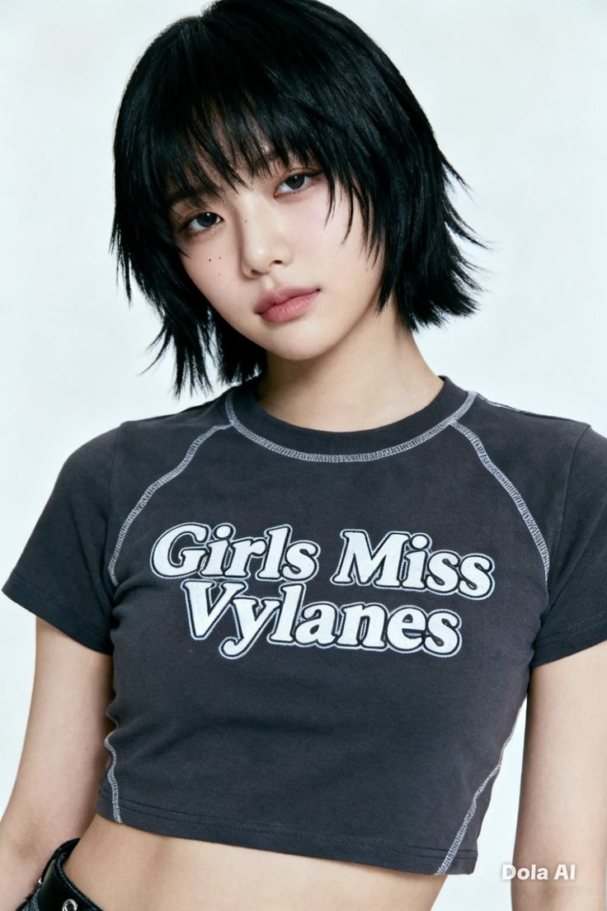 | 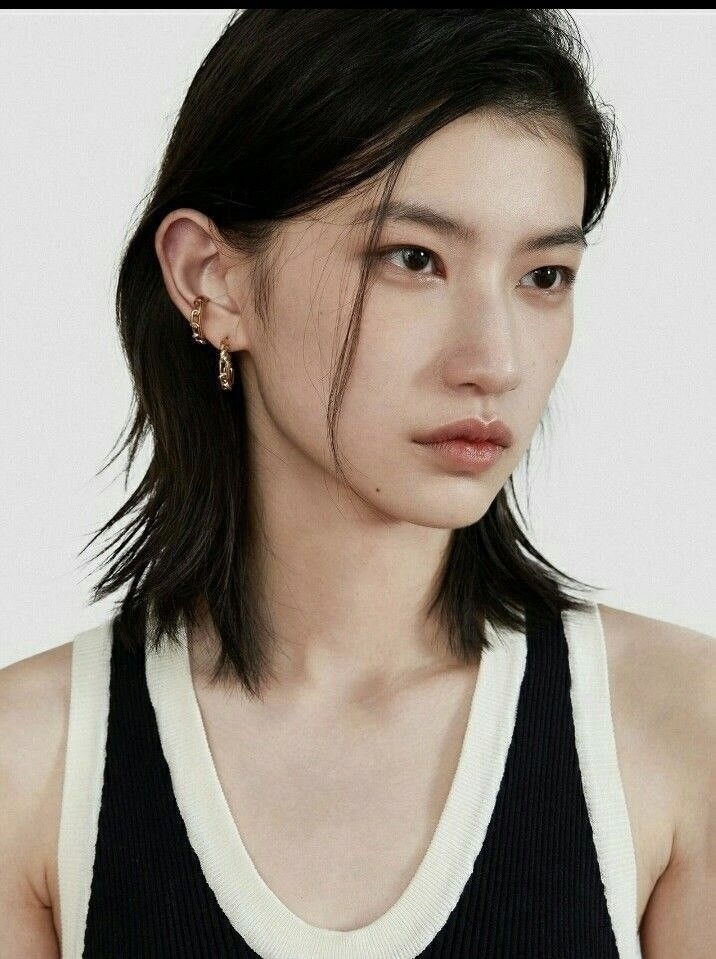 | 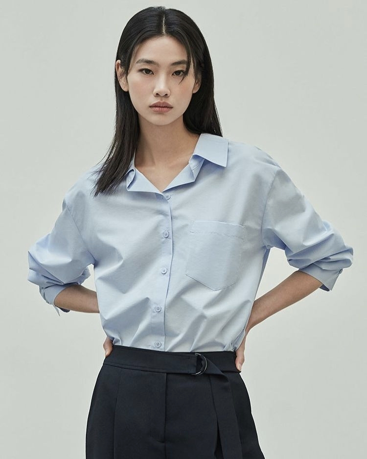 |
| 04 | 05 | 06 |
| 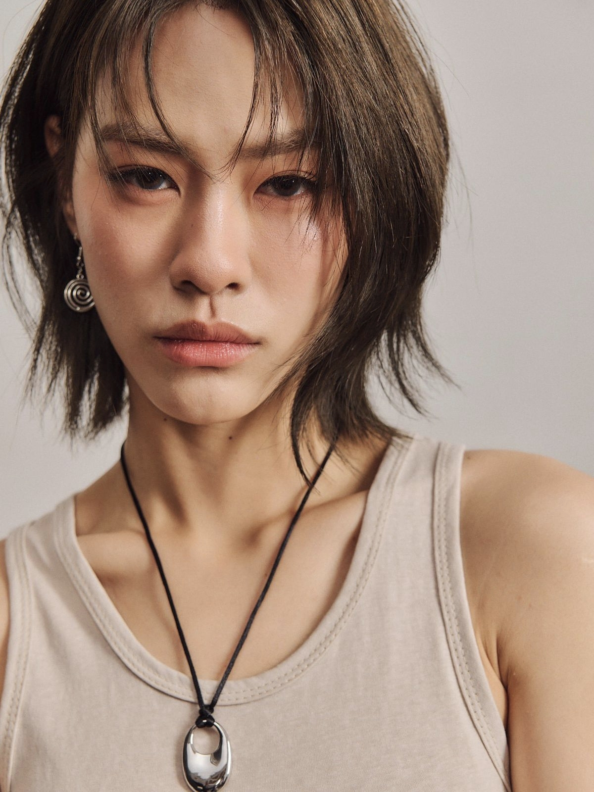 | 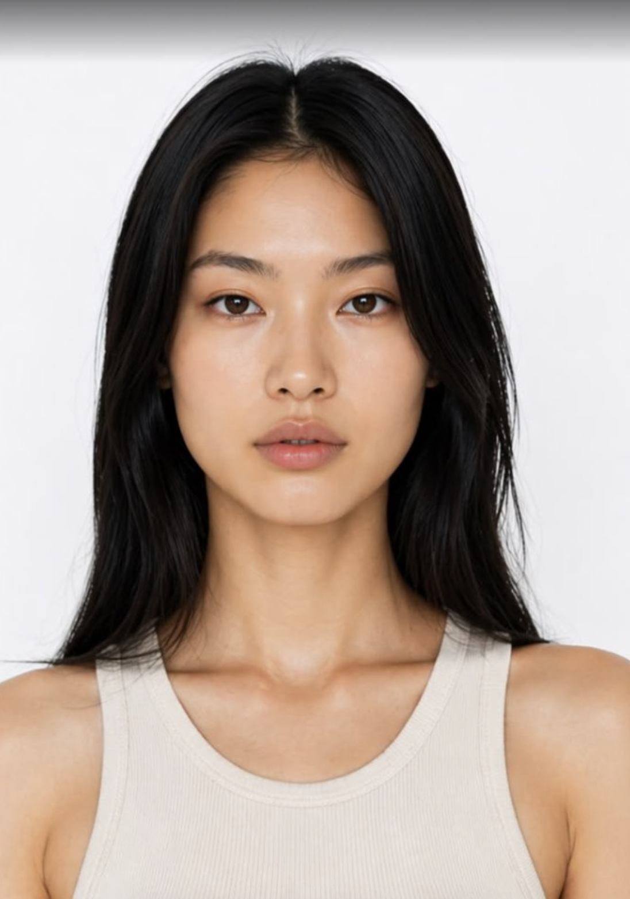 | 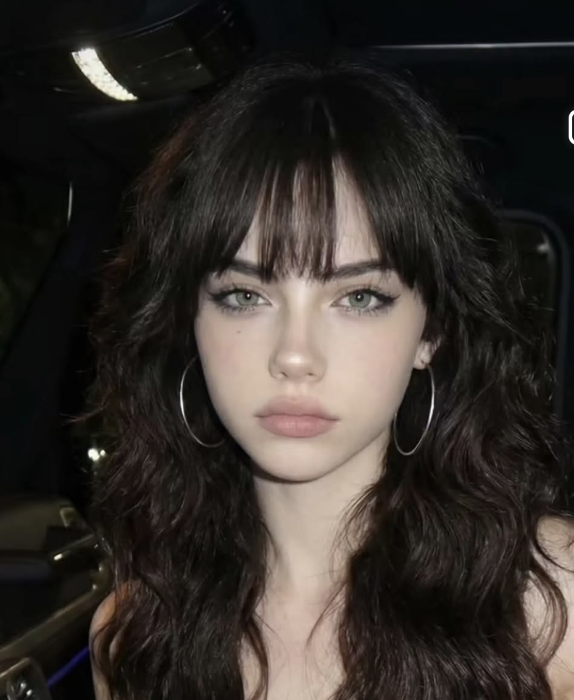 |
| 07 | 08 | 09 |
| 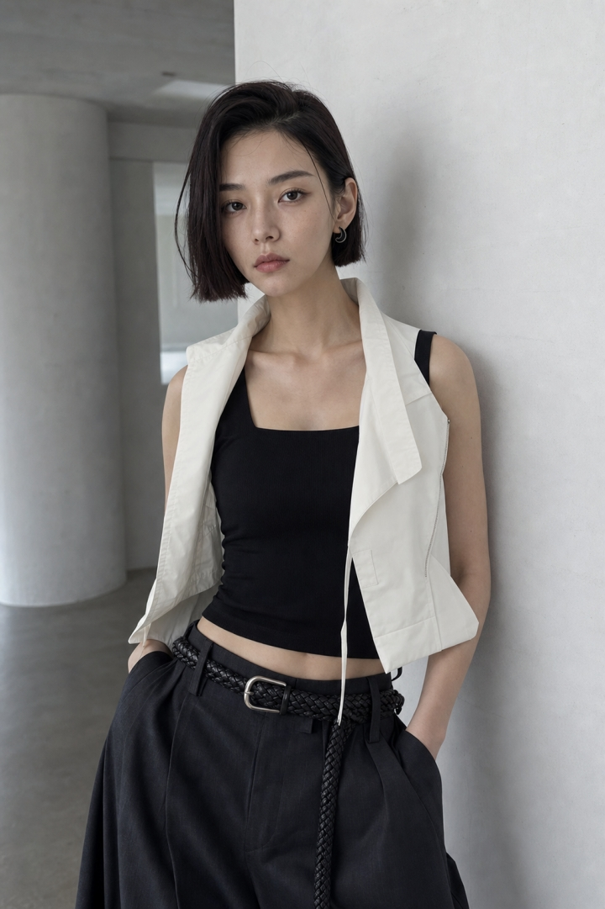 | 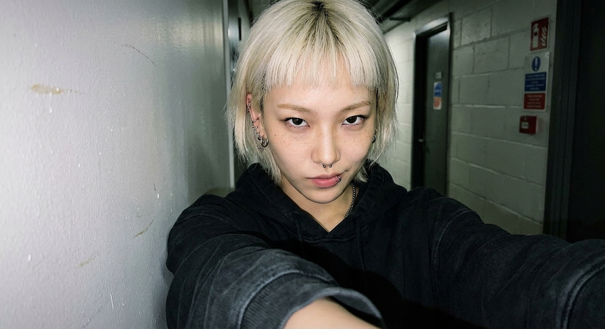 | 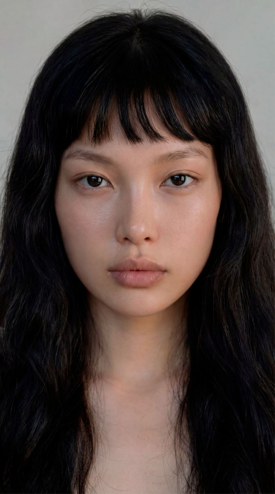 |

| 参考 | 主要提取内容 | 建议权重 | 不提取内容 |
|---|---|---:|---|
| 01 | 黑色碎层短发、薄碎刘海、柔和杏仁眼、淡唇 | 18% | T 恤文字与具体真人身份 |
| 02 | 稍长脸型、清晰下颌、低眉眼距离、湿感锁骨发 | 16% | 耳饰的具体设计 |
| 03 | 中分直发、平直眉、极简克制、干净职业感 | 10% | 具体服装版型 |
| 04 | 横向拉长的眼型、颧骨与下颌张力、灰棕眼妆 | 18% | 具体首饰与单张面孔 |
| 05 | 正面比例、自然皮肤、不过度修饰的唇鼻关系 | 16% | 证件照式僵硬与过度对称 |
| 06 | 长发的松弛体积、外眼线与轻微夜间氛围 | 5% | 面部骨相、瞳色与浓睫毛 |
| 07 | 不对称短发、清冷都市感、利落而松弛的状态 | 8% | 具体穿搭组合 |
| 08 | 很轻的地下感、真实雀斑/皮肤、直视镜头的态度 | 3% | 漂发、穿孔与明显朋克符号 |
| 09 | 原生肤质、窄双眼皮、薄碎刘海与自然厚唇 | 6% | 过度柔弱或幼态感 |

结论：参考图按人物身份参考与主题造型参考分开管理。生成新人物时只调用对应原型的结构参考，不跨人物平均五官；Y2K等主题优先改变妆容、发型整理与服装，不重新设计脸。

### 2.1 女性参考分组

| 路线 | 参考图 | 使用原则 |
|---|---|---|
| F01 清冷极简 | 新图1、2 | 提取紧凑轮廓、克制窄长眼与冷感；去除对“猫系”标签的强制依赖 |
| F02 中性先锋 | 新图3、4、6 | 提取长窄骨相、横长眼、宽直下颌、银灰层次发与地下感 |
| F03 自然淡颜 | 新图5、7 | 提取自然正面比例、低妆感、松散发型和原生肤质 |
| F04 摩登浓颜 | 通过结构混合方法新建 | 旧候选图弃用；保留明确眉眼、鼻唇和颧区体量，不绑定夜景或派对 |
| F05 灵动甜酷 | 新图8仅作部分结构与气质参考 | 提取短中庭、开阔杏眼、清晰唇形和灵动感；不得复制参考身份 |
| Y2K造型模块 | 新图8＋新增三张参考 | 提取黑白撞色短上衣、细眼线、粉调妆容、长直发与年轻运动感；不替代05的骨相身份 |
| 未分配 | 新图9 | 当前不参与任何人物生成 |

F01–F03 的结构链路验证见 [Round 11 Structural Roster](./casting-round-11-structural-roster/casting-board.md)；Y2K 造型验证见 [Round 09 Casting Board](./casting-round-09-three-characters-plus-styling/casting-board.md)。F04、F05 以本文件文字身份锁为准，不依赖旧候选图。

### 2.2 男性参考分组

| 路线 | 参考角色 | 提取的身份结构 | 仅作造型参考／不提取 |
|---|---|---|---|
| M01 清冷智性 | 男性参考图2、5 | 清洁紧致轮廓、冷静窄杏眼、清楚眉眼关系、自然直鼻、克制口唇与理性距离感 | 黑白光影、眼镜、白衬衫和具体真人身份 |
| M02 柔美精致 | 男性参考图6 | 平滑柔和椭圆脸、细长柔和眼型、自然收束下颌、清晰但不过厚的唇部体量 | 金发可选；浅瞳、混血感与具体真人身份不提取 |
| M03 自然松弛 | 男性参考图4 | 自然颊区、柔和下颌、平静杏眼、普通鼻形、温暖肤质与放松状态 | 海边场景、绑带上衣与具体真人身份 |
| M04 都市利落 | 男性参考图3 | 明确眉骨与下颌、较强直鼻、稳定眼神、成熟都市行动感 | 连帽衫、戒指、项链、建筑背景与具体真人身份 |
| M05 年轻活力 | 男性参考图1 | 紧凑柔和棱角脸、中短中庭、灵活窄杏眼、略饱满嘴唇与轻盈状态 | 灰棕发、耳环、夜间闪光灯和具体真人身份 |

男性参考同样只用于抽象结构。每次生成必须重新组合为原创亚洲男性，至少在三个结构轴上与参考及现有人物不同；发色、眼镜、首饰、场景与服装不计入身份差异。

---

## 3. 双人物体系身份框架 / IDENTITY FRAMEWORK

本节只规定品牌共同质量线；具体脸型与五官结构以「1.1女性路线」「1.2男性路线」及第7节身份提示词为最高优先级。共同规则不能把十条路线重新平均成同一张脸，也不能因主题妆造而改变身份。

### 3.1 年龄与整体轮廓

- 全部明确为 18–30 岁亚洲成年人；单个角色锁定后不得跨镜头改变年龄或人物体系。
- 女性五路线与男性五路线分别建立外轮廓、中庭、眼型、鼻唇和下颌；路线编号接近不代表共享同一张脸。
- 所有人物禁止尖翘 V 脸、医美模板鼻与不合理的极窄下颌。
- 每位角色至少在脸部纵横比、颧骨／面颊分布、下颌宽度、眼型、鼻形或嘴唇宽度中的三个维度与其他角色不同。
- 面部左右允许 2%–4% 的自然不对称，避免 AI 式完美镜像脸。

### 3.2 眼睛

- 以自然亚洲眼部结构为母体，允许窄长、深邃、轻微开阔、眼距中等或略开、单眼皮或窄双等路线差异。
- 眼裂、眼距、眼睑重量必须服务于对应角色结构；禁止十条路线共用完全相同的猫眼模板。
- 双眼皮褶皱以窄而浅为主，也可使用自然单眼皮或内双；不做欧式大双。
- 内眼角自然、略尖，外眼尾干净延伸；下眼睑平顺，保留轻微真实阴影。
- 瞳色深棕近黑，瞳孔比例自然；禁止大直径美瞳、玻璃珠眼和明显异色瞳。
- 静止眼神是“观察与判断”，不是瞪视，也不是困倦无神。

### 3.3 眉毛

- 眉位、眉眼距离与眉骨强弱按路线确定；清冷与都市路线可更低更清楚，自然与柔美路线可更舒展。
- 以中等粗细的自然平直眉为主，允许弱眉峰和轻微不齐；不强制所有角色共用一条眉形。
- 保留根根分明的毛流与少量空隙；禁止细挑眉、粗黑平眉和纹眉块面感。

### 3.4 鼻子

- 鼻梁高度、宽度和鼻头体量按路线变化，可从自然偏宽到纤细直鼻；山根始终自然，不做突兀高山根。
- 鼻头可钝圆、普通或略有骨感，但不能尖翘；鼻翼保持真实亚洲比例。
- 正面鼻孔不过度外露；侧面线条近直，禁止夸张翘鼻和医美模板鼻。

### 3.5 嘴唇

- 唇宽中等偏宽，边界自然，不刻意描绘。
- 上唇略薄于下唇，唇峰柔和；下唇有体积但不注射感。
- 嘴角基本平直，静止时微微放松，不噘嘴、不固定微笑。
- 原生唇色为低饱和灰粉或豆沙裸色。

### 3.6 皮肤与稳定识别点

- 中性偏暖的浅肤色至浅中等肤色，不追求病态冷白。
- 可见细小毛孔、鼻翼与眼下的自然纹理；T 区只保留很轻的真实光泽。
- 不磨皮，不塑料，不瓷娃娃，不使用大面积高光。
- 每位入选角色单独选择一个稳定识别点，例如小痣、眉毛缺口或轻微天然不对称；不同角色不能共享同一颗痣。候选阶段不强制添加，身份锁阶段确定后保持位置与大小一致。

### 3.7 静止表情

- 嘴唇自然闭合或留极细缝隙，下颌放松。
- 眼神直视镜头时保持平静、自信、略带距离感。
- 情绪强度控制在 20%–35%，避免夸张皱眉、挑眉、张嘴或商业式大笑。

### 3.8 女性／男性独立路线规则

- 女性与男性路线是两套平行选角系统，不使用“同一路线的男女版本”或一键性别转换。
- **女性体系：**允许清冷、中性、自然、浓颜和甜酷五种不同量感；面颊、下颌、眼鼻唇均以每条 F 路线为准。
- **男性体系：**允许清冷智性、柔美精致、自然松弛、都市利落和年轻活力五种不同量感；“男性”不等于统一增强眉骨、方下颌和肩宽。
- 男性默认无明显胡须或仅有极淡真实胡茬；如需胡须必须单独指定，并在连续镜头中锁定长度和边界。
- M02 的柔美来自平滑轮廓、温柔眼型和精致唇鼻，不等于女性化装扮，也不使用浅瞳或混血感来制造辨识度。
- M05 必须看起来是 18–30 岁成年人；年轻感来自紧凑比例、灵活眼神与发型动势，而不是幼童脸、校服或未成年体态。
- 同一群像中，每两位角色都必须在至少三个结构轴上不同；禁止直接把一张脸跨体系转换。

---

## 4. 双人物体系发型系统与主题变化

### 4.1 女性发型 / F01–F05

- **F01 清冷极简：**中分长直自然黑发或锁骨直发，发根低体积，一侧可轻别耳后；克制、干净、低造型感。
- **F02 中性先锋：**深色自然发根的烟灰／银灰肩长 Wolf-Lob，配不齐微刘海、脸侧与后颈长层次；允许轻微地下感。
- **F03 自然淡颜：**深棕松散长波浪、锁骨自然发或轻薄不规则刘海，整体弱造型、低蓬度，保留自然飞发。
- **F04 摩登浓颜：**利落长直发、大弧度侧分或低位光洁盘发；强调额头、眉眼和颧区结构。
- **F05 灵动甜酷：**长直层次发、轻薄刘海、高马尾或半扎；允许一至两束脸侧发丝。

### 4.2 男性发型 / M01–M05

- **M01 清冷智性：**自然黑中短层次、轻薄侧分或低体积后梳；轮廓整洁并露出部分自然发际线，不做传统商务油头。
- **M02 柔美精致：**自然黑、深棕或低饱和浅金的中长羽毛层次，可至耳下或后颈；发丝轻盈、面部周围有柔和层次。浅金只是可选造型，不绑定浅瞳或混血外观。
- **M03 自然松弛：**自然黑或深棕中长波纹、松散中分或不规则侧分；允许风动、轻毛躁和不完全对称。
- **M04 都市利落：**深色短至中短碎层、轻湿感纹理或利落侧分；线条干净、有方向感，但不做油腻背头。
- **M05 年轻活力：**黑色、深棕或灰棕轻碎层、轻狼尾、风动短发或额前细碎发；轻盈但不过度偶像化。

发型不得成为人物唯一识别点。任何染发都需保留亚洲人物身份与自然深色眉毛、发根逻辑，不通过夸张漂染掩盖骨相同质化。

### 4.3 Y2K主题变化（不是新人物）

- 女性优先叠加在 F05，冷感版本可用 F01，自然版本可用 F03；男性优先叠加在 M05，都市版本可用 M04。
- 保留角色原发际线、脸型与基础长度，只增加轻薄眉长刘海、两束脸侧发丝和少量简洁金属发夹。
- 允许黑直发、黑银脸侧挑染或轻微半扎，但不得通过Y2K造型把同一角色变成另一张脸。
- Y2K识别应主要来自撞色短上衣、运动拼接、细猫眼线、粉调腮红唇妆或少量蓝色眼影。

### 共同连续性

- 每位角色锁定发际线、发缝、长度、基础发色和标志性整理方式。
- 允许同一路线做轻微湿度、风动和束状变化，但不能跨角色交换发型。
- 禁止假发头套感、每镜发缝变化、过度高颅顶、随机漂染和不符合动作的头发静止。

---

## 5. 妆容系统

### 5.1 底妆

- 目标是“真实皮肤被整理过”，不是“无瑕皮肤被重做”。
- 薄透、半哑光至自然缎光；遮盖明显泛红，但保留鼻梁、眼下与脸颊的细微纹理。
- 不提亮整张脸，不用厚重粉底，不做明显水光肌。

### 5.2 眉眼

- 眉毛只用灰棕色轻补空隙，维持低位平直结构。
- 眼影以灰棕、冷茶棕、低饱和藕灰为主，贴近睫毛根部晕染。
- 上眼线极细，重点是将外眼尾横向延长 2–4 mm，而非明显上挑猫眼。
- 下眼线只在外侧 1/3 留淡灰棕阴影；不要卧蚕高光。
- 睫毛根根分明、长度自然；不使用浓密假睫毛和明显下睫毛束。

### 5.3 修容与腮红

- 只做很轻的颧下和下颌过渡，保留原生骨相。
- 腮红控制在几乎不可察觉的低饱和裸玫瑰/灰粉色，位置靠后。
- 不做鼻头腮红、眼下大片腮红和强烈面中提亮。

### 5.4 唇妆

- 哑光或低光泽的灰粉、干燥玫瑰、豆沙裸色。
- 唇线柔化但不能糊成渐变唇；不扩唇、不玻璃唇、不使用鲜红或荧光色。

### 妆容强度

- 日间品牌主片：25%–35%。
- 夜间或情绪镜头：40%–50%，只加深外眼尾与睫毛根部，不改变五官。
- 超过 50% 即偏离本人物体系。
- 男性基础妆容：10%–25%，以均匀肤色、整理眉毛、压低油光和极淡眼部阴影为主；M02 柔美精致可提升至 30%，但禁止男团舞台妆、浓重眼线和蜡感修容。

---

## 6. 面部画面质感

- 真实时装摄影，而非美妆电商图、手机自拍或证件照。
- 面部特写优先 85mm–105mm 等效焦段；半身优先 50mm–85mm。
- 镜头高度接近眼睛或略低 2–5 cm，强化平静、直面的力量。
- 柔和大面积主光从正侧前方进入，保留鼻侧与下颌的浅阴影。
- 皮肤不过曝，高光不过白；黑发中必须保留层次，不能糊成纯黑块。
- 允许细微胶片颗粒与轻微色差，但不能覆盖五官结构。
- 面部特写禁止使用 24mm–35mm 广角，避免鼻子放大、脸缘拉伸和身份漂移。

---

## 7. 双人物体系身份提示词与主题造型模块

### 7.1 共享母提示词

```text
原创虚构人物，一位18–30岁的亚洲{女性／男性}，服务于当代品牌广告。人物必须自然高级、潮酷、时尚，拥有真实皮肤纹理、轻微自然不对称与明确的原创骨相；不得复制现实人物身份，不得生成网红模板脸、女团／男团舞台妆、油腻商务脸或医美式尖V脸。高级亚洲时装编辑摄影，克制妆造，平静而有个性的直视眼神。
```

```text
Original fictional character, an adult Asian {woman/man} aged 18–30 for a contemporary brand film. Natural premium presence, cool fashion sensibility, honest skin texture, slight natural asymmetry, and an original structurally distinct face. Do not copy a real person's identity. Avoid influencer templates, female-idol or male-idol stage styling, oily corporate stereotypes, gym-influencer faces, and cosmetic-surgery V-lines. Premium Asian fashion editorial photography, restrained grooming, calm direct gaze with individual character.
```

### 7.2 女性路线结构追加词 / F01–F05

```text
F01 CLEAN MINIMAL / 清冷极简 WOMAN: compact round-oval or softly oval face without childish proportions; short-to-medium midface; clean softly defined jaw and medium-width rounded-blunt chin; narrow calm almond eyes with low natural lids and restrained spacing; low straight brows; ordinary low-to-medium nose bridge with a softly rounded tip; balanced natural lips; slightly full natural cheeks, minimal visual noise and a cool composed gaze. Use natural black low-volume hair according to Section 4.

F02 ANDROGYNOUS SIGNAL / 中性先锋 WOMAN: long rectangular-oval face; medium-long midface; high lateral cheekbones with subtle planar definition; broad nearly parallel jaw sides; longer broad blunt chin with a softly squared U base; narrow heavy-lidded almond eyes with modest spacing; very low straight brows; longer natural nose; upper lip thinner than lower lip; mature softness around the mouth. Use smoky platinum, ash-black or natural-black layered hair according to Section 4.

F03 NATURAL CURRENT / 自然淡颜 WOMAN: medium-length softly elongated oval face; medium midface; low gently distributed cheek structure; softly narrowing jaw and medium-width rounded chin; softly open medium almond eyes with moderate-to-slightly-close spacing; slightly uneven straight brows; low-to-medium slightly broader natural nose with rounded tip; medium-wide relaxed lips; gentle cheek and lip softness; quiet approachable gaze. Use natural deep-brown or black relaxed hair according to Section 4.

F04 MODERN STATEMENT / 摩登浓颜 WOMAN: medium to medium-long sculpted oval face; clearly readable cheek structure without gauntness; defined brows and deeper-set elongated almond eyes of natural Asian proportions; medium eye spacing; straight medium-height nose with visible but non-surgical projection; well-defined medium-full lips, smoother jaw transitions and firm mouth shape; confident mature gaze and strong facial presence. “Bold-featured” describes bone and feature volume, not heavy makeup and not a night-only setting.

F05 PLAYFUL EDGE / 灵动甜酷 WOMAN: short-to-medium compact oval face with a short midface but unmistakably adult proportions; softly rounded cheeks with a controlled jaw; medium-to-open almond eyes, moderately wide-set but not oversized, with lively focus; natural straight brows; compact ordinary nose with rounded tip; clearly shaped natural lips with a slightly fuller lower lip and clear lip peaks; energetic, clever and slightly rebellious expression. Avoid baby face, doll eyes, schoolchild cues and idol-template cuteness.

```

### 7.3 男性路线结构追加词 / M01–M05

```text
M01 COOL INTELLECT / 清冷智性 MAN: medium to medium-long compact oval face; clean cheek plane and a controlled jaw that is defined without becoming broad or rugged; medium midface; narrow calm almond eyes with moderate spacing and a focused observant gaze; tidy natural brows with readable but not heavy brow structure; straight ordinary medium-height nose; balanced lips with a restrained resting line. Intelligent, cool and credible rather than corporate. Use natural black medium-short layers, a light side part or low-volume swept-back hair. Avoid glasses as the only sign of intelligence.

M02 SOFT REFINED / 柔美精致 MAN: narrow soft oval face with smooth cheek transitions; medium-short to medium midface; softly tapered jaw ending in a rounded narrow-but-not-pointed chin; elongated gentle almond eyes with slightly lowered upper lids and calm warmth; natural refined brows; slim low-to-medium nose bridge with a soft tip; clearly shaped medium-full lips and a subtle relaxed smile. Graceful, polished and light without becoming a female impersonation, idol doll or mixed-heritage template. Use natural black, deep-brown or restrained low-saturation blond feathered medium-length hair; keep dark natural brows and Asian facial structure.

M03 NATURAL EASE / 自然松弛 MAN: medium softly oval face; natural cheek fullness and a jaw of ordinary width with soft corners; medium midface; relaxed medium almond eyes with modest spacing; slightly uneven natural brows; low-to-medium slightly broader ordinary nose with a rounded tip; medium relaxed lips. Healthy warm skin, quiet presence and an unforced outdoor ease. Use black or deep-brown medium-length natural waves with loose movement and a few flyaways. Avoid polished resort-model perfection.

M04 URBAN SHARP / 都市利落 MAN: medium to medium-long face; readable brow structure, cheek plane and straight jaw without a hypermasculine block shape; medium midface; slightly deeper elongated almond eyes with direct stable focus; natural strong straight brows; straight medium-height nose with a visible but non-surgical base; medium lips with a firm resting line. Decisive, mature and physically present with urban momentum, not aggressive, macho or gangster-coded. Use dark short-to-medium textured layers, light wet separation or a clean side direction.

M05 YOUTHFUL ENERGY / 年轻活力 MAN: compact softly angular oval face with unmistakably adult proportions; short-to-medium midface; gently filled cheeks and a clean but not pointed jaw; narrow lively almond eyes with medium spacing; natural straight brows; ordinary straight low-to-medium nose with a rounded tip; slightly fuller natural lips. Responsive, playful and energetic, never childlike or male-idol cute. Use black, deep-brown or grey-brown light fragmented layers, wind-moved short hair or a restrained soft mullet.
```

### 7.4 Y2K造型追加词（不改身份）

```text
[选中F05／F01／F03或M05／M04的完整身份锁，不改写]
Y2K styling only: for a woman, a fitted black-and-white contrast ringer baby tee or sporty cropped top; for a man, a fitted or slightly boxy contrast ringer tee or short-sleeve athletic knit. Use sporty curved panel seams and one small original abstract emblem, no letters and no third-party brand. Preserve natural skin and the approved identity. Woman grooming may use soft dusty-pink eye wash, extremely thin horizontal eyeliner, diffused cool-rose blush and muted pink lips. Man grooming uses clean skin, subtle brow definition and only a trace of taupe eye contour. Preserve the character's hairline and base hair length, adding only route-compatible fringe, face-framing strands, minimal chrome clips or a thin sport headband. Preserve exact face shape, eye spacing, nose, lips, apparent age and recognizable identity. Y2K comes from styling, never from a new face.
```

### 7.5 镜头变量追加模板

```text
[选中角色的完整身份锁，不改写]
Scene: {场景与时间}
Wardrobe: {服装，不遮挡主要脸部结构}
Expression: {符合路线的轻微情绪，强度不超过35%}
Action: {单一、明确、可持续的动作}
Camera: {景别、焦段、机位与运动}
Lighting: {主光方向、软硬与色温}
Continuity: preserve this character's exact facial proportions, apparent age, hairline, stable mark, hair length, parting and makeup across every frame. Never blend facial traits from another route.
```

---

## 8. 负面提示词 / NEGATIVE CONSTRAINTS

```text
celebrity likeness, real-person clone, influencer face, female-idol styling, male-idol styling, oily corporate man, gym-influencer face, hypermasculine block head, childlike face, baby face, doll face, schoolchild cues, pointed V-line chin, oversized eyes, high deep double eyelids, circle lenses, glassy anime eyes, surgery-template nose, overfilled lips, lip filler, heavy contour, glossy glass skin, porcelain skin, plastic skin, airbrushed skin, beauty filter, whitening, excessive symmetry, thick block brows, heavy glitter makeup, false lashes, exaggerated aegyo-sal, bright blush, gradient lips, wet glossy lips, random freckles, changing stable-mark position, changing face shape, changing eye spacing, changing gender presentation, direct gender-swapped clone, changing hairstyle between frames, blending facial traits between routes, commercial smile, exaggerated pout, harsh angry expression, wide-angle facial distortion, smartphone selfie, beauty e-commerce lighting, European or mixed-heritage appearance when the casting scope requires Asian people
```

---

## 9. 生成与验收标准

### 9.1 最小人物链路测试 / 默认

只验证 `taste.md → 人物图` 是否可用时，生成以下一张图即可：

1. 一位原创亚洲成年人，并明确使用女性或男性人物体系；
2. 从 F01–F05 或 M01–M05 中选择一条路线；
3. 正面或轻微 15° 胸像，85–105mm 人像视角；
4. 中性灰白背景、基础发型、克制妆容、平静表情；
5. 检查路线骨相、成年感、亚洲外观、真实皮肤和非明星身份。

本项目已经用 F01、F02、F03 完成女性最小链路测试，并用 [M02 Makaron 投放测试图](./casting-round-13-male-taste-test/m02-soft-refined-makaron-ad-v1.png) 完成男性单文件测试，证明 `taste.md → 原创人物图` 可以在不输入真人参考图的情况下运行。M02 首次结果通过基础投放门槛，但面部克制感略靠近 M01；详见 [QC](./casting-round-13-male-taste-test/qc_report.md)。F04、F05 与其余男性路线已形成可直接调用的文字身份锁。多角度测试不是使用本文件的必要步骤。

### 9.2 标准最终人物套图 / 用户确认人物后

快速测试可以只交一张正面图；用户确认该人物方向后，最终交付必须升级为同一身份的完整套图：

1. **身份特写：**正面或轻微 15°，胸部以上，85–105mm，用于确认脸型、眼鼻唇、发际线、年龄和肤质。
2. **半身投放主视觉：**腰部以上，人物偏左或偏右构图，保留可放标题、产品或 CTA 的负空间。
3. **全身穿搭照：**从头发到两只鞋底完整入镜，70–85mm；清楚展示上装、下装、鞋、包与配饰之间的比例，手脚不得裁切或畸变。
4. **45°身份补充：**左右任选一个最能验证颧区、鼻梁与下颌的角度；进入视频前再补齐双侧。
5. **广告适配说明：**列出该人物最适合的 3–5 类广告、推荐造型模块、推荐情绪和不适合的广告类型。

如需更完整的投放包，可增加第二套全身 Look、动态动作图、表情板、横版留白构图与视频首帧。所有图片必须沿用同一张获批身份图，服装和场景变化不得重设计脸。

当前 M02 测试套图包含 [半身投放主视觉](./casting-round-13-male-taste-test/m02-soft-refined-makaron-ad-v1.png) 与 [LOOK 01 全身穿搭照](./casting-round-13-male-taste-test/m02-soft-refined-makaron-fullbody-look01-v1.png)，用于验证身份从头像扩展到全身造型的链路。

### 9.3 连续视频身份锁 / 仅在需要时

当人物确定要进入同一广告片的多个连续镜头时，再补充：

1. 正脸无表情特写，85–105mm，干净灰白背景。
2. 左右 45° 特写，光线与妆容相同。
3. 左右侧脸，确认鼻梁、下巴和后脑轮廓。
4. 同一光线下的轻微闭眼、轻微侧目、极浅微笑。
5. 主发型 A 的胸像与全身比例图。

### 9.4 PASS

- 正面、45°、侧面仍能一眼认出是同一人物。
- 脸型、眼距、鼻头、唇厚、痣的位置保持稳定。
- 人物好看但不像统一模板的网红脸，也不指向某一现实人物。
- 短发轮廓轻薄、有层次，黑发暗部仍有细节。
- 妆容不抢脸，皮肤保留真实纹理。
- 气质准确对应所选路线；男性不变成油腻、凶狠或健身网红，女性不变成幼态、名媛或偶像模板。

### 9.5 REROLL

- 下巴变尖、眼睛变圆变大、鼻梁突然升高、嘴唇注射感明显。
- 每个角度像不同人，或发型一变就无法识别角色。
- 生成结果明显贴近某一张真人参考，而不是新的综合角色。
- 磨皮、假睫毛、强修容或高光让人物进入美妆广告审美。

### 9.6 BLOCK / 禁止进入视频制作

- 角色基准正脸尚未得到人工确认。
- 45° 与正脸的结构明显不一致。
- 视频首尾帧的痣、发际线、眼距或下颌发生变化。
- 仅凭发型和妆容相似，而骨相没有被稳定锁定。

---

## 10. 穿搭系统 / WARDROBE DNA

### 10.1 一句话穿搭方向

**以水洗牛仔和深色运动基础款为骨架，通过“上紧下松 / 上松下短”的比例、轻复古校园符号、小体积配饰和一处克制露肤，形成 Z 世代喜欢的潮酷、高级、年轻但不过度用力的都市造型。**

这不是纯 Y2K，也不是传统美式校园风，而是更当代的组合：

- 40% 都市水洗牛仔与极简基础款
- 30% 复古运动 / Campus Athletics
- 20% 成熟克制的 Neo-Y2K
- 10% 轻学院与个性色彩点缀

### 10.2 穿搭参考总览

| 01 | 02 | 03 | 04 |
|---|---|---|---|
| 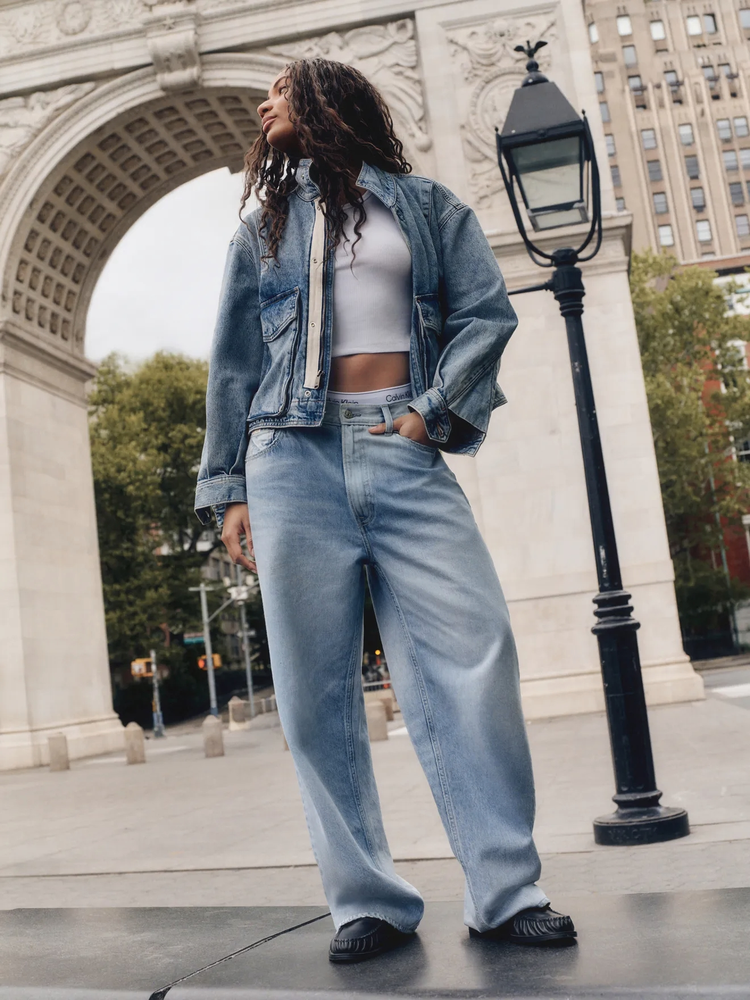 | 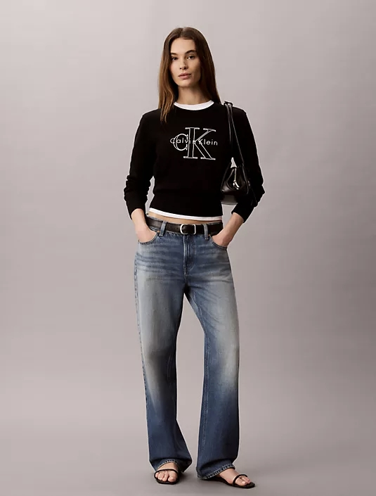 | 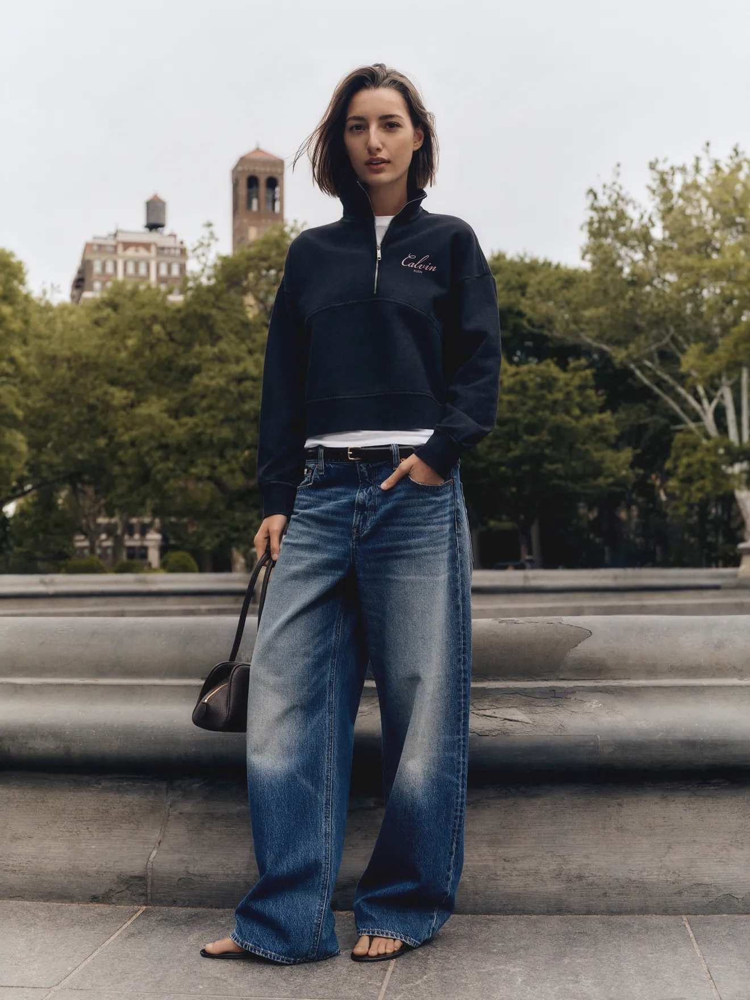 | 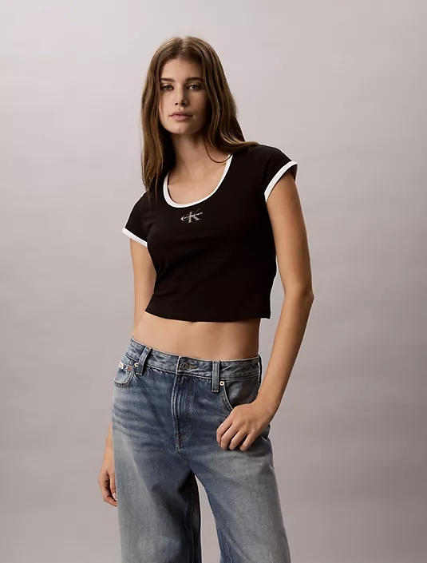 |
| 05 | 06 | 07 | 08 |
| 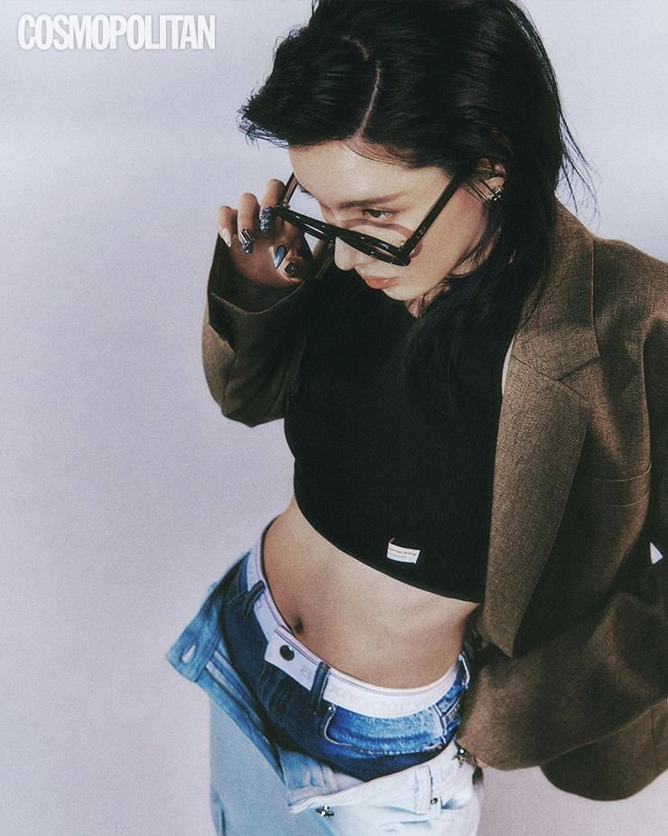 | 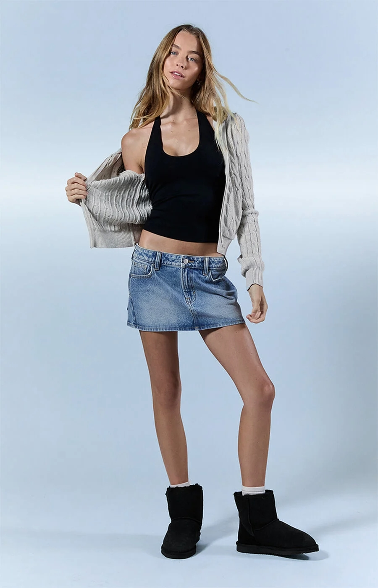 | 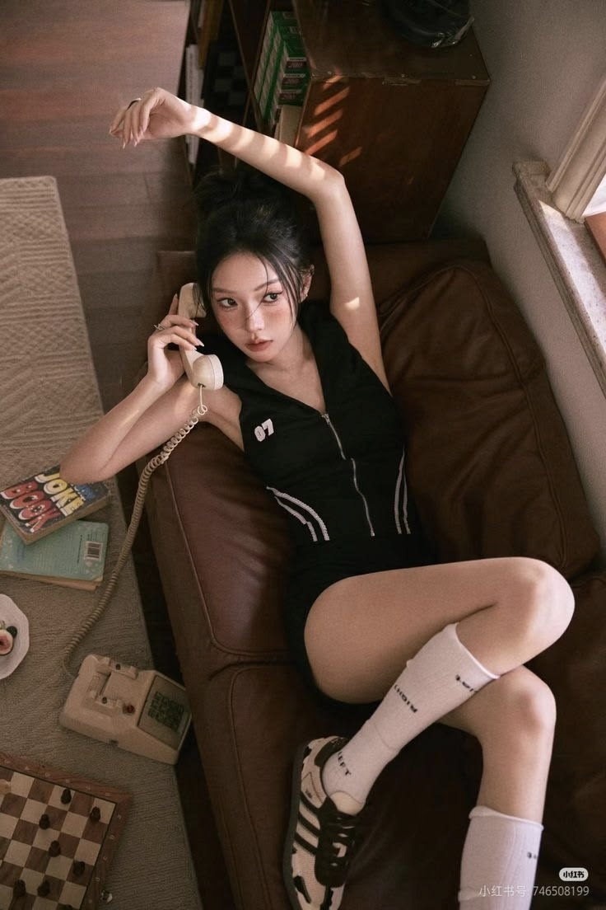 | 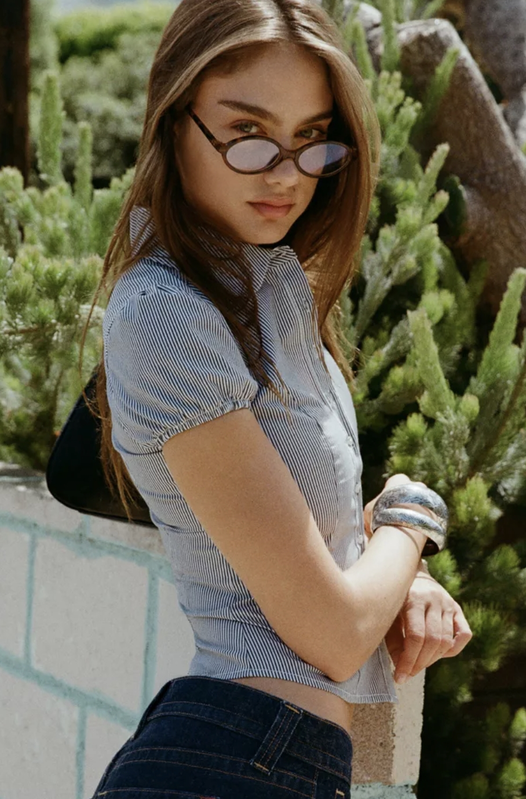 |
| 09 | 10 | 11 | 12 |
| 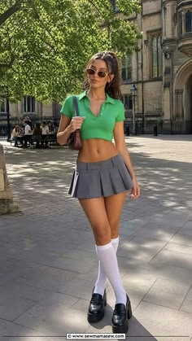 | 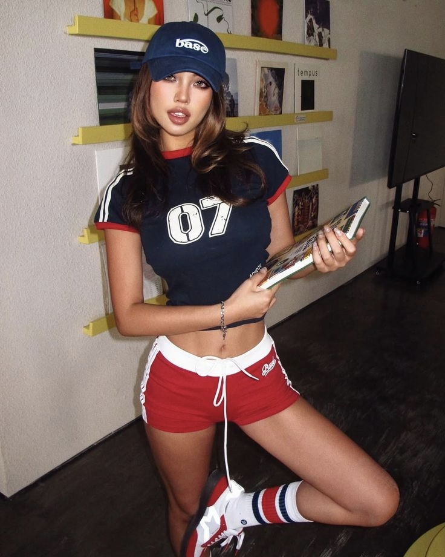 | 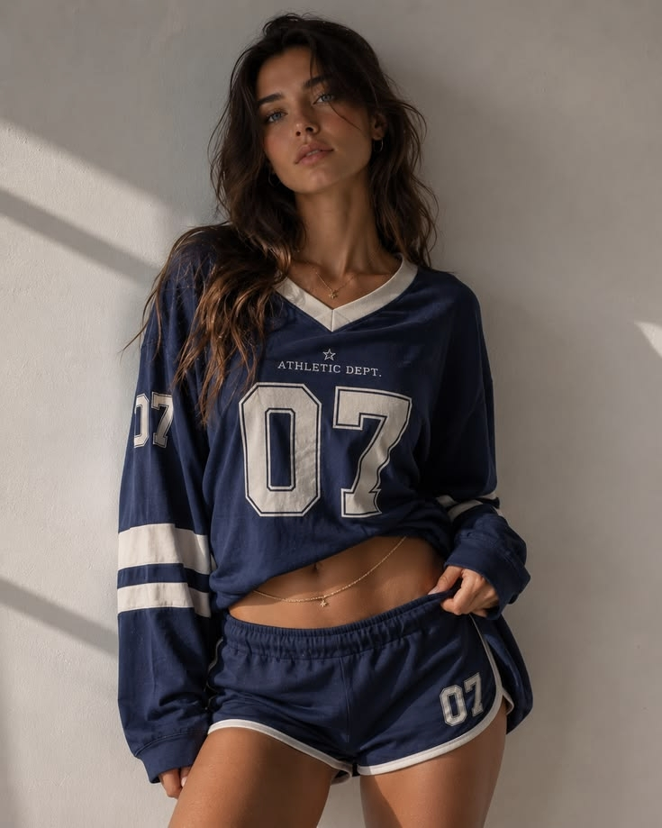 | 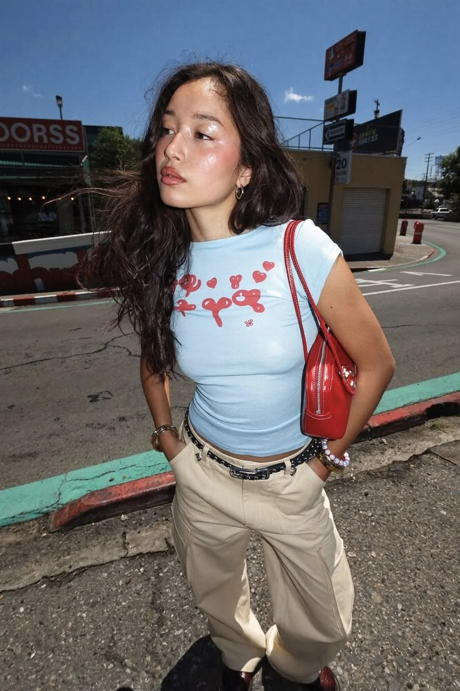 |
| 13 | 14 |  |  |
| 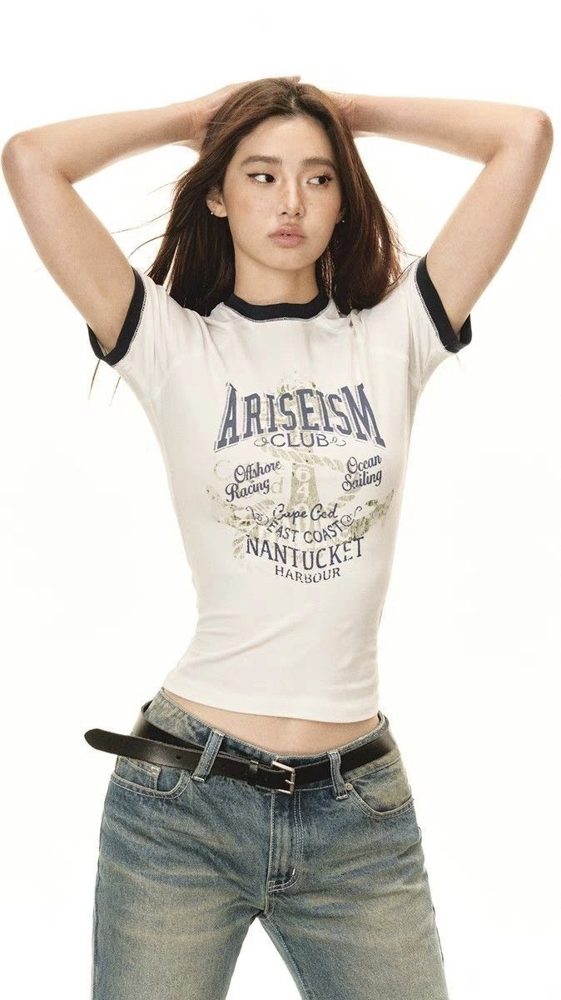 | 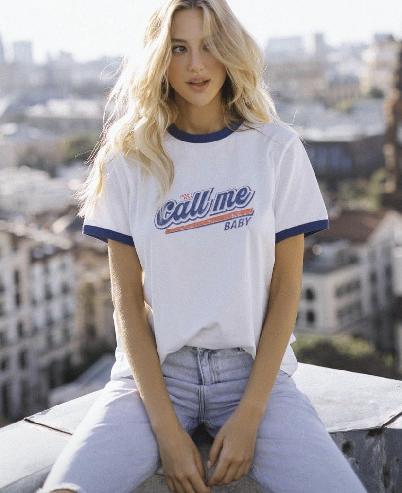 |  |  |

| 参考 | 主要提取内容 | 建议权重 | 使用限制 |
|---|---|---:|---|
| 01 | 浅水洗 Denim-on-denim、白色贴身内搭、超宽裤腿 | 10% | 不复制第三方内衣腰头与 Logo |
| 02 | 黑色合体针织、旧化直筒牛仔、小肩包的干净都市感 | 4% | 不照搬品牌字标 |
| 03 | 海军蓝半拉链上衣、白色内搭边、超宽深水洗牛仔 | 10% | 裤长必须与鞋形成真实堆叠 |
| 04 | 黑白滚边短上衣、中腰旧化牛仔、极简比例 | 8% | 不做过度紧身全套 |
| 05 | 棕色宽肩西装、黑色短内搭、窄框眼镜、高低混搭 | 7% | 不使用解开裤门或刻意内衣外露 |
| 06 | 黑色挂脖、灰色麻花开衫、牛仔短裙、厚底短靴 | 5% | 作为轻学院支线，不做主视觉 |
| 07 | 黑色运动连体短装、白袜、复古球鞋与室内 Y2K 氛围 | 6% | 保持成年表达，避免制服化和幼态姿势 |
| 08 | 蓝白细条纹衬衫、深靛牛仔、椭圆眼镜、银色手镯 | 7% | 只提取廓形与配饰关系 |
| 09 | 彩色短 Polo、百褶短裙、及膝袜、乐福鞋 | 3% | 绿色只做点色，避免校服感与过度甜美 |
| 10 | 深蓝红滚边运动短 T、跑步短裤、帽子与条纹袜 | 7% | 图案和编号改为品牌自有视觉 |
| 11 | Oversized 球衣、运动短裤、同色成套的松弛感 | 7% | 控制露肤，不做健身广告质感 |
| 12 | 婴儿蓝贴身 T、卡其工装裤、红色小肩包 | 9% | 主片中最适合承担彩色造型 |
| 13 | 白色 Ringer Tee、细皮带、低腰旧化牛仔 | 8% | 胸前图案必须原创或使用品牌 VI |
| 14 | 宽松白色 Ringer Tee、浅水洗牛仔、日光青春感 | 9% | 避免普通旅游纪念衫质感 |

结论：**01 / 03 / 04 / 12 / 13 / 14 构成主衣橱；05 / 08 提升编辑感；07 / 09 / 10 / 11 提供运动支线；06 只作为极少量柔和变化。**

### 10.3 人物年龄与身体表达

- 所有演员必须明确为 18–30 岁成年人；主角维持 24–28 岁。
- 身形自然、健康、纤长或匀称均可，禁止极端纤瘦、夸张腰臀比例和人体滤镜。
- 年轻感来自服装比例、动作和态度，不来自幼态脸、学生身份暗示或刻意装嫩。
- 露肤是造型中的比例工具，不是性感主叙事；主视觉建议一次只露出腰部、肩颈或腿部中的一个区域。

#### 女性／男性人物体系的穿搭适配

- **女性人物：**可使用短款 Ringer Tee、Baby Tee、背心、短裙与自然腰部露肤，但必须保持成年、健康和非性化表达。
- **男性人物：**将 Baby Tee 替换为合身或略短的 Ringer Tee／针织短袖；短背心替换为合身罗纹背心；短裙默认替换为宽松短裤或直筒及膝裙裤。可保留 0–3 cm 的克制腰部露肤，但不默认露腹。
- 男性人物保留“上合下松、上松下短、建筑外套加合身内搭”三类比例，不直接套用夸张宽肩西装、健身紧身衣或传统商务正装。
- 男女群像应共享色彩、材质和品牌图形语言，但服装尺寸、肩线、胸腰结构与裤装裆部必须符合各自身体，不做简单复制粘贴。
- 两套人物体系都禁止夸张沙漏、倒三角健身身材和人体滤镜；身体吸引力来自姿态、比例和服装结构。

### 10.4 核心廓形规则

#### 规则 A：上紧下松 / 首选

- 贴身 Baby Tee、Ringer Tee、短背心或短针织。
- 搭配中低腰或自然腰的超宽牛仔裤、阔直牛仔或宽松工装裤。
- 上身长度落在肚脐上方 1–4 cm，腰部露肤约 2–6 cm；不使用夸张低胸。
- 裤腿从大腿开始保持空间，脚面允许自然堆叠，但不能拖地变形。

#### 规则 B：上松下短 / 运动支线

- Oversized 球衣、半拉链卫衣、宽松运动上衣或男友感 T 恤。
- 搭配短跑裤、直筒短裙或简洁百褶裙。
- 下装必须清晰可见，避免被上衣完全遮住造成“无下装”效果。
- 用中筒袜或及膝袜连接鞋履，但每套造型只使用一种明显的运动符号。

#### 规则 C：短内搭 + 建筑感外套 / 编辑支线

- 贴身黑色背心或短 T 作为内层。
- 外搭宽肩旧化牛仔夹克、棕灰西装、短款功能夹克或灰色针织开衫。
- 外层开放穿着，形成垂直线并露出腰线；肩部可以宽，但不做夸张时装秀造型。
- 一套造型最多三层，确保 AI 能稳定理解穿衣顺序和物理关系。

### 10.5 单品词典

#### 上装

- 贴身短款 Ringer Tee：细滚边、小圆领、棉质、有轻微旧化。
- Baby Tee：圆领或小 U 领，袖长至上臂中段，不做深 V。
- 半拉链运动卫衣：海军蓝或炭黑，低肩线，轻微洗旧。
- 球衣 / Jersey：宽松落肩、复古数字或品牌自有字样，禁止真实球队标识。
- 短背心：黑、白或灰，罗纹棉质；挂脖只用于次要造型。
- 外套：宽松牛仔夹克、短款功能夹克、旧化棕灰西装、灰色麻花针织开衫。

#### 下装

- 超宽牛仔裤：主单品，浅水洗或深靛水洗，腰头结构真实。
- 阔直牛仔裤：用于更干净、商业化的造型。
- 卡其工装裤：宽松直腿，口袋控制在 2–4 个，不做战术装备感。
- 运动短裤：尼龙或棉质，圆弧包边，长度覆盖臀线。
- 牛仔短裙 / 简洁百褶裙：只用于少量支线造型，裙长以健康运动感为准。

#### 鞋履

- 黑色扁平皮鞋、厚底 Creeper、轻量乐福鞋。
- 复古薄底训练鞋、低帮板鞋或跑鞋。
- 黑色短靴只与短裙造型搭配，鞋底不过度厚重。
- 极简细带鞋只用于更成熟的都市牛仔造型；不使用华丽高跟鞋。

#### 配饰

- 小体积横向肩包 / East-West Bag，黑、深棕或一处强调色。
- 窄椭圆或窄矩形太阳镜，深色镜片，镜框不超过脸宽。
- 细黑皮带，可保留 5–10 cm 自然垂落带尾。
- 银色小耳圈、单只宽手镯、细项链或细腰链，整套最多选两类。
- 棒球帽只用于运动造型，帽型低而软，不遮住人物主要识别点。

### 10.6 材质语言

- **核心材质：**有真实斜纹与洗色层次的牛仔、厚薄适中的棉质 Jersey、细罗纹棉、旧化运动针织。
- **高级调节：**哑光棕灰西装料、真实皮革小包、氧化银色金属、细密针织。
- **材质对比：**一套造型至少存在一次“硬 / 软”对比，例如硬挺牛仔 + 贴身棉 T，宽肩西装 + 轻薄短背心。
- 旧化是色落、柔软与边缘磨损，不是大面积破洞、脏污、涂鸦或做旧滤镜。
- 禁止廉价高亮涤纶、塑料皮、反光胶印与过多金属铆钉。

### 10.7 色彩系统

#### 基础色 / 约 75%

- 深海军蓝 `#171D2E`
- 炭黑 `#151515`
- 牛奶白 `#EEECE6`
- 水泥灰 `#A5A2A0`
- 深靛牛仔 `#2B4053`
- 浅水洗牛仔 `#7E96A7`

#### 结构色 / 约 15%

- 烟草棕 `#5A4438`
- 卡其米色 `#B8AA8D`
- 冷灰蓝 `#AFC9D7`

#### 强调色 / 不超过 10%

- 运动红 `#A83A35`
- 草地绿 `#4D9A5D`
- 柔和粉紫 `#B9A4B8`

每套造型只使用一个强调色；强调色优先出现在包、滚边、印花或帽子，不铺满全身。

### 10.8 图案、字标与品牌处理

- 可使用复古校队数字、短字标、弧形 Collegiate 排版和小面积胸章作为图形语言。
- 字标面积应小于上装正面面积的 25%，避免整套都是大 Logo。
- 参考图中的第三方品牌、杂志名称、球队名称、号码组合和商品字样均不进入生成提示词。
- 在品牌 VI 尚未提供时，生成阶段使用纯色、无标识服装或抽象占位图形。
- 品牌 VI 确认后，只替换印花与标识，不改变已经批准的廓形、材质和配色关系。
- 可见腰头如需字样，只能使用本品牌自有字标；否则保持无标识。

### 10.9 七套推荐造型

#### LOOK 01 — HERO DENIM

- 浅水洗宽松牛仔夹克，开放穿着。
- 白色罗纹短背心或短 T。
- 同色系超宽牛仔裤，腰部露肤约 3 cm。
- 黑色扁平 Creeper 或薄底复古训练鞋。
- 仅佩戴银色小耳圈。
- 用途：主海报、人物首次登场、城市日景。

#### LOOK 02 — NAVY URBAN

- 旧化海军蓝半拉链卫衣，内露 2 cm 白色下摆。
- 深水洗超宽牛仔裤。
- 小型黑色横向肩包、细黑腰带。
- 黑色薄底鞋。
- 用途：步行、城市广场、建筑空间镜头。

#### LOOK 03 — BLACK RINGER

- 黑色贴身短款 Ringer Tee，牛奶白细滚边。
- 中腰灰蓝旧化阔直牛仔裤。
- 细皮带与单只银色宽手镯。
- 用途：棚拍、产品近景、干净高级的品牌画面。

#### LOOK 04 — EDITORIAL BLAZER

- 烟草棕或炭灰宽肩西装，开放穿着。
- 黑色贴身无袖短内搭。
- 中腰浅水洗牛仔裤。
- 窄矩形眼镜与深棕小肩包；其余配饰取消。
- 用途：夜间、室内、节奏切换与更成熟的编辑感镜头。

#### LOOK 05 — BLUE CARGO ACCENT

- 冷灰蓝贴身 Baby Tee，胸前使用品牌自有小图形。
- 卡其宽松工装裤，口袋结构简洁。
- 运动红小肩包作为唯一强调色。
- 黑色低帮板鞋。
- 用途：阳光街景、年轻社交氛围、色彩段落。

#### LOOK 06 — BRAND ATHLETICS

- 深海军蓝品牌自有球衣或运动短 T，牛奶白滚边，少量运动红点缀。
- 同色圆弧运动短裤，露出清楚的下装轮廓。
- 白色中筒袜与复古训练鞋。
- 棒球帽与肩包二选一，不同时出现。
- 用途：音乐、动作、群像与社交媒体竖版素材；不作为全片唯一造型。

#### LOOK 07 — Y2K RINGER MODULE

- 作为主题造型叠加在已批准人物上，不创建新的Y2K专属脸。
- 黑白撞色贴身 Ringer Baby Tee 或短款无袖运动上衣，使用弧形拼接与本品牌自有小图形。
- 搭配低腰但不过度暴露的水洗直筒牛仔裤、短裙叠安全裤或干净运动短裤。
- 妆容使用粉调眼影、极细横向猫眼线、冷玫瑰腮红与缎光粉唇；可选少量青蓝眼影作为强调。
- 发型只在原角色基础上增加轻薄刘海、脸侧发丝、简洁金属发夹或少量银灰挑染，不改变发际线与脸型。
- 禁止复制参考中的第三方品牌文字、蝴蝶标识、口号和具体版型图案。
- 用途：年轻社交、游戏、校园氛围、轻运动与短视频广告。

### 10.10 穿搭生成提示词模块

#### 中文版

```text
[完整人物身份锁，不改写]。成年 Z 世代都市时装主角，潮酷、克制、高级，穿搭采用当代高低混搭：{LOOK 编号及完整单品顺序}。明确的{上紧下松 / 上松下短 / 短内搭加建筑感外套}廓形，真实水洗牛仔、棉质 Jersey、罗纹棉、哑光皮革与氧化银材质。基础色为海军蓝、炭黑、牛奶白和水洗牛仔色，只保留一个小面积强调色。所有服装无第三方品牌标识、无真实球队图案、无杂志字样；如需图形，只使用品牌自有或抽象占位图形。健康自然的成年身体比例，真实织物重量、缝线、褶皱、裤腰、袖口、口袋和层叠关系。高级当代时装 Lookbook 与街头编辑摄影，不是电商白底图，不是廉价 Y2K 变装。
```

#### English version

```text
[Preserve the complete character identity lock without rewriting it.] Adult Gen-Z urban fashion protagonist, cool, restrained and premium, wearing a contemporary high-low look: {complete LOOK number and garment order}. A clearly readable {fitted-top with wide-bottom / oversized-top with short-bottom / cropped-base-layer with architectural outerwear} silhouette. Honest washed denim, cotton jersey, fine ribbed cotton, matte leather and oxidized silver materials. Core colors are deep navy, charcoal black, milk white and washed denim, with only one small accent color. No third-party logos, real sports-team marks, magazine titles or copied garment graphics; use only original brand-owned graphics or abstract placeholders. Healthy natural adult body proportions, realistic fabric weight, stitching, folds, waistband, cuffs, pockets and physically correct layering. Premium contemporary fashion lookbook and street-editorial photography, not white-background e-commerce, not a cheap Y2K costume.
```

### 10.11 穿搭负面约束

```text
copied fashion-brand logo, magazine watermark, real sports-team logo, trademarked slogan, random text, garbled typography, logo stacking, cheap Y2K costume, sexualized school uniform, childlike styling, overly sexual pose, lingerie campaign, exposed branded underwear, unbuttoned fly, extreme low-rise pants, excessive cleavage, exaggerated hourglass body, exaggerated bodybuilder torso, impossible tiny waist, full-body skin-tight outfit, gym-influencer styling, corporate suit stereotype, skinny jeans, all-oversized shapeless outfit, neon rainbow palette, more than one accent color, rhinestones, excessive studs, massive platform shoes, luxury evening heels, shiny polyester, plastic leather, fake denim texture, excessive ripped jeans, random pockets, asymmetric sleeves by mistake, fused layers, disappearing jacket, changing garment color, changing hem length, changing shoe design, extra bag straps, malformed sunglasses, unreadable text
```

### 10.12 视频连续性与验收

#### 每套 Look 必须锁定

- 外套、内搭、下装、鞋和配饰的准确数量、颜色、材质与穿着顺序。
- 裤腰高度、上衣长度、露肤范围、袖子状态与衣摆是否塞入。
- 包的左右肩、背带长度；眼镜是否佩戴；外套是穿着、手持还是脱下。
- 图形在胸前的固定位置与大小；没有 VI 时保持纯色或抽象占位。

#### 动作连续性

- 若外套从穿着变为脱下，画面必须出现手抓衣领、手臂退出袖管、外套被手持或放置的完整过程。
- 若人物摘下眼镜或帽子，物件必须从脸部/头部移动到手中或可见位置，不能凭空消失。
- 若肩包换肩，必须通过可见的提带动作完成；否则全段固定在同一侧。
- 一个短镜头只安排一个主要服装动作，避免 AI 同时处理走路、脱外套、拿包和戴眼镜。

#### PASS

- 一眼能读出清楚的主廓形，层次关系不混乱。
- 人物在不同角度仍是同一年龄、同一身体比例和同一面孔。
- 牛仔洗色、衣长、裤腰、鞋型与配饰在镜头首尾保持一致。
- 年轻感来自比例、材质和动作，而不是堆叠过多流行符号。
- 没有第三方 Logo、乱码字样或未经批准的品牌资产。

#### REROLL

- 裤型从阔腿变直筒、上衣长度变化、外套突然闭合或配饰换边。
- 衣服与身体粘连，夹克和内搭融合，包带穿过手臂或头发。
- 全身同时紧身、全身同时宽大，导致比例没有重点。
- 造型像廉价复古派对服、普通网红套装或运动健身广告。

#### BLOCK / 禁止进入成片

- 服装上出现无法确认授权的第三方品牌或球队标识。
- 同一连续动作中服装、鞋、包或眼镜无原因改变。
- 使用服装或姿势令成年角色呈现明显幼态或制服化性暗示。
- 衣物物理关系错误，遮挡、穿插或凭空消失足以破坏画面可信度。

---

## 11. 后续待补充

- 品牌与产品的核心价值
- 场景、空间、道具与时代感
- 整体画面色彩、介质与后期质感
- 景别组合、镜头运动、剪辑节奏与声音设计

上述内容补齐后，本文件升级为完整的品牌宣传片 `taste.md v1.0`。
